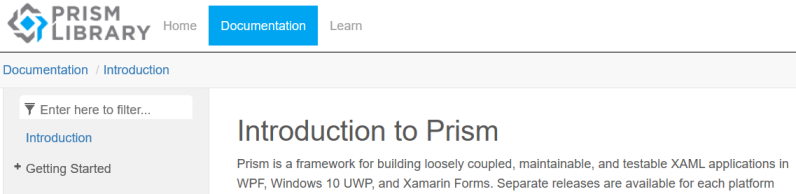

# Prism-Documentation

This is the official repository for the [Prism](https://github.com/PrismLibrary/Prism) project documentation and the raw content of the docs [website](http://prismlibrary.github.io/docs/).

# Overview of Prism

Prism is a framework for building loosely coupled, maintainable, and testable XAML applications in WPF, Windows 10 UWP, and Xamarin Forms.

