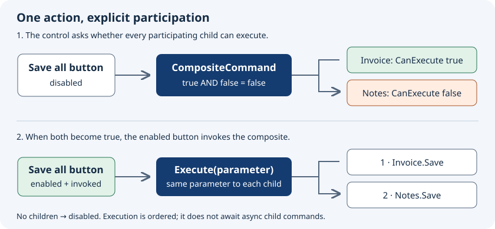

# Composite commands

A `Prism.Commands.CompositeCommand` exposes one `ICommand` to the UI and forwards it to registered child commands. A shell's **Save all** action is a useful example: each open document owns its own save command, while the shell does not need to know each document's concrete view-model type.

Use the same composite-command service instance in the shell and its participants. The command is UI-framework independent; WPF, .NET MAUI, Uno and Avalonia can bind to it.

## How enabled state and execution flow



The diagram describes a normal control invocation: the control checks `CanExecute` before calling `Execute`. Prism's composite itself does not perform that check inside `Execute`.

| Participating children | `CanExecute` |
| --- | --- |
| No children | `false` |
| Invoice can save; notes can save | `true` |
| Invoice can save; notes cannot save | `false` |
| Activity monitoring enabled; no active children | `false` |

For a **Save all** command, a clean document often needs a no-op save that can execute. If its predicate returns false merely because it has no changes, it disables saving every other document too. Choose the predicate according to the meaning of the aggregate action.

## Creating a CompositeCommand

```csharp
using Prism.Commands;

public interface IApplicationCommands
{
    CompositeCommand SaveCommand { get; }
}

public sealed class ApplicationCommands : IApplicationCommands
{
    public CompositeCommand SaveCommand { get; } = new();
}
```

Register the shared service once in application composition:

```csharp
containerRegistry.RegisterSingleton<IApplicationCommands, ApplicationCommands>();
```

Inject it into the shell view model and expose it for binding:

```csharp
public sealed class ShellViewModel
{
    public ShellViewModel(IApplicationCommands commands) => Commands = commands;
    public IApplicationCommands Commands { get; }
}
```

Bind the button's `Command` to `{Binding Commands.SaveCommand}`. Set its label with the host's normal content property (`Content` on WPF/Uno/Avalonia; `Text` on .NET MAUI).

## Registering and unregistering child commands

```csharp
using Prism.Commands;
using Prism.Mvvm;

public sealed class DocumentViewModel : BindableBase, IDisposable
{
    private readonly IApplicationCommands _commands;
    private readonly IDocument _document;
    private bool _isValid = true;

    public DocumentViewModel(IApplicationCommands commands, IDocument document)
    {
        _commands = commands;
        _document = document;
        SaveCommand = new DelegateCommand(_document.Save, () => IsValid)
            .ObservesProperty(() => IsValid);
        _commands.SaveCommand.RegisterCommand(SaveCommand);
    }

    public DelegateCommand SaveCommand { get; }

    public bool IsValid
    {
        get => _isValid;
        set => SetProperty(ref _isValid, value);
    }

    public void Dispose() =>
        _commands.SaveCommand.UnregisterCommand(SaveCommand);
}

public interface IDocument
{
    void Save();
}
```

The composite holds strong references to its children and subscribes to their `CanExecuteChanged` events. The document owner must unregister when the document is permanently removed. Wire that cleanup into your host's actual lifetime; `IDisposable` in this example is an explicit ownership contract, not a promise that every region automatically disposes view models.

Registering the same command twice or registering a composite in itself throws. The `RegisteredCommands` property returns a copy; modifying that list does not register or unregister commands.

## Executing active commands only

Create `new CompositeCommand(monitorCommandActivity: true)` when the action should involve only active participants. A child implementing `Prism.IActiveAware` participates only while its `IsActive` is true. `DelegateCommand` and `AsyncDelegateCommand` implement this interface; their initial `IsActive` is false.

```csharp
public CompositeCommand SaveActiveCommand { get; } = new(true);

// When the owning document's active state changes:
SaveCommand.IsActive = isActive;
```

A region's activation of a view/view model does not automatically set every command property on that view model. Forward the relevant active state deliberately. Children that do not implement `IActiveAware` continue to participate even when monitoring is enabled.

## Execution and failures

Execution takes a snapshot of participating children and invokes them in registration order with the same parameter. It is not transactional: if one synchronous child throws, later children are not reached and earlier work is not rolled back.

Although an `AsyncDelegateCommand` can be registered because it implements `ICommand`, the composite invokes its `ICommand.Execute` bridge and does **not** await the task. For an asynchronous Save all workflow, use one `AsyncDelegateCommand` that awaits a coordinating service, chooses sequential or parallel behavior explicitly, and defines partial-failure and cancellation policies. See [async commands](async-commands.md).

## Source and tests

[CompositeCommand implementation](https://github.com/PrismLibrary/Prism/blob/b8f00b5091063feea127a2417fc72d6b299ee16c/src/Prism.Core/Commands/CompositeCommand.cs) and [behavior tests](https://github.com/PrismLibrary/Prism/blob/b8f00b5091063feea127a2417fc72d6b299ee16c/tests/Prism.Core.Tests/Commands/CompositeCommandFixture.cs) cover registration, empty state, active-state filtering and forwarding.
