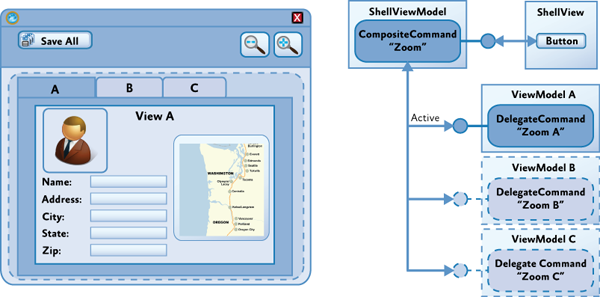

# Composite Commands
In many cases, a command defined by a view model will be bound to controls in the associated view so that the user can directly invoke the command from within the view. However, in some cases, you may want to be able to invoke commands on one or more view models from a control in a parent view in the application's UI.

For example, if your application allows the user to edit multiple items at the same time, you may want to allow the user to save all the items using a single command represented by a button in the application's toolbar or ribbon. In this case, the Save All command will invoke each of the Save commands implemented by the view model instance for each item as shown in the following illustration.


Prism supports this scenario through the `CompositeCommand` class.

The `CompositeCommand` class represents a command that is composed from multiple child commands. When the composite command is invoked, each of its child commands is invoked in turn. It is useful in situations where you need to represent a group of commands as a single command in the UI or where you want to invoke multiple commands to implement a logical command.

The `CompositeCommand` class maintains a list of child commands (`DelegateCommand` instances). The `Execute` method of the `CompositeCommand` class simply calls the `Execute` method on each of the child commands in turn. The `CanExecute` method similarly calls the `CanExecute` method of each child command, but if any of the child commands cannot be executed, the `CanExecute` method will return `false`. In other words, by default, a `CompositeCommand` can only be executed when all the child commands can be executed.

> [!NOTE]
> `CompositeCommand` can be found in the Prism.Commands namespace which is located in the Prism.Core NuGet package.

> [!Video https://www.youtube.com/embed/kssprOqdfME]

## Creating a Composite Command
To create a composite command, instantiate a `CompositeCommand` instance and then expose it as either an `ICommand` or `ComponsiteCommand` property.
```cs
    public class ApplicationCommands
    {
        private CompositeCommand _saveCommand = new CompositeCommand();
        public CompositeCommand SaveCommand
        {
            get { return _saveCommand; }
        }
    }
```

## Making a CompositeCommand Globally Available
Typically, CompositeCommands are shared throughout an application and need to be made available globally. It's important that when you register a child command with a `CompositeCommand` that you are using the same instance of the CompositeCommand throughout the application. This requires the CompositeCommand to be defined as a singleton in your application.  This can be done by either using dependency injection (DI), or by defining your CompositeCommand as a static class.

### Using Dependency Injection
The first step in defining your CompositeCommands is to create an interface.
```cs
    public interface IApplicationCommands
    {
        CompositeCommand SaveCommand { get; }
    }
```

Next, create a class that implements the interface.
```cs
    public class ApplicationCommands : IApplicationCommands
    {
        private CompositeCommand _saveCommand = new CompositeCommand();
        public CompositeCommand SaveCommand
        {
            get { return _saveCommand; }
        }
    }
```
Once you have defined your ApplicationCommands class, you must register it as a singleton with the container.

```cs
    public partial class App : PrismApplication
    {
        protected override void RegisterTypes(IContainerRegistry containerRegistry)
        {
            containerRegistry.RegisterSingleton<IApplicationCommands, ApplicationCommands>();
        }
    }
```

Next, ask for the `IApplicationCommands` interface in the ViewModel constructor.  Once you have an instance of the `ApplicationCommands` class, can now register your DelegateCommands with the appropriate CompositeCommand.
```cs
    public DelegateCommand UpdateCommand { get; private set; }

    public TabViewModel(IApplicationCommands applicationCommands)
    {
        UpdateCommand = new DelegateCommand(Update);
        applicationCommands.SaveCommand.RegisterCommand(UpdateCommand);
    }
```

### Using a Static Class
Create a static class that will represent your CompositeCommands
```cs
public static class ApplicationCommands
{
    public static CompositeCommand SaveCommand = new CompositeCommand();
}
```

In your ViewModel, associate child commands to the static `ApplicationCommands` class.
```cs
    public DelegateCommand UpdateCommand { get; private set; }

    public TabViewModel()
    {
        UpdateCommand = new DelegateCommand(Update);
        ApplicationCommands.SaveCommand.RegisterCommand(UpdateCommand);
    }
```

> [!NOTE]
> To increase the maintainability and testability of your code, it is recommended that you using the dependency injection approach.

## Binding to a Globally Available Command
Once you have created your CompositeCommands, you must now bind them to UI elements in order to invoke the commands.

### Using Depency Injection
When using DI, you must expose the `IApplicationCommands` for binding to a View.  In the ViewModel of the view, ask for the `IApplicationCommands` in the constructor and set a property of type `IApplicationCommands` to the instance.
```cs
    public class MainWindowViewModel : BindableBase
    {
        private IApplicationCommands _applicationCommands;
        public IApplicationCommands ApplicationCommands
        {
            get { return _applicationCommands; }
            set { SetProperty(ref _applicationCommands, value); }
        }

        public MainWindowViewModel(IApplicationCommands applicationCommands)
        {
            ApplicationCommands = applicationCommands;
        }
    }
```

In the view, bind the button to the `ApplicationCommands.SaveCommand` property. The `SaveCommand` is a property that is defined on the `ApplicationCommands` class.
```xml
<Button Content="Save" Command="{Binding ApplicationCommands.SaveCommand}"/>
```

### Using a Static Class
If you are using the static class approach, the following code example shows how to bind a button to the static ApplicationCommands class in WPF.
```xml
<Button Content="Save" Command="{x:Static local:ApplicationCommands.SaveCommand}" />
```

## Unregister a Command
As seen in the previous examples, child commands are registered using the `CompositeCommand.RegisterCommand` method. However, when you no longer wish to respond to a CompositeCommand or if you are destroying the View/ViewModel for garbage collection, you should unregister the child commands with the `CompositeCommand.UnregisterCommand` method.
```cs
    public void Destroy()
    {
        _applicationCommands.UnregisterCommand(UpdateCommand);
    }
```

> [!Important]
> You MUST unregister your commands from a `CompositeCommand` when the View/ViewModel is no longer needed (ready for GC). Otherwise you will have introduced a memory leak.

## Executing Commands on Active Views
Composite commands at the parent view level will often be used to coordinate how commands at the child view level are invoked. In some cases, you will want the commands for all shown views to be executed, as in the Save All command example described earlier. In other cases, you will want the command to be executed only on the active view. In this case, the composite command will execute the child commands only on views that are deemed to be active; it will not execute the child commands on views that are not active. For example, you may want to implement a Zoom command on the application's toolbar that causes only the currently active item to be zoomed, as shown in the following diagram.



To support this scenario, Prism provides the `IActiveAware` interface. The `IActiveAware` interface defines an `IsActive` property that returns `true` when the implementer is active, and an `IsActiveChanged` event that is raised whenever the active state is changed.

You can implement the `IActiveAware` interface on views or ViewModels. It is primarily used to track the active state of a view. Whether or not a view is active is determined by the views within the specific control. For the Tab control, there is an adapter that sets the view in the currently selected tab as active, for example.

The `DelegateCommand` class also implements the `IActiveAware` interface. The `CompositeCommand` can be configured to evaluate the active status of child DelegateCommands (in addition to the `CanExecute` status) by specifying `true` for the `monitorCommandActivity` parameter in the constructor. When this parameter is set to `true`, the `CompositeCommand` class will consider each child DelegateCommand's active status when determining the return value for the `CanExecute` method and when executing child commands within the `Execute` method.

```cs
    public class ApplicationCommands : IApplicationCommands
    {
        private CompositeCommand _saveCommand = new CompositeCommand(true);
        public CompositeCommand SaveCommand
        {
            get { return _saveCommand; }
        }
    }
```

When the `monitorCommandActivity` parameter is `true`, the `CompositeCommand` class exhibits the following behavior:

- `CanExecute`: Returns `true` only when all active commands can be executed. Child commands that are inactive will not be considered at all.
- `Execute`: Executes all active commands. Child commands that are inactive will not be considered at all.

By implementing the `IActiveAware` interface on your ViewModels, you will be notified when your view becomes active or inactive. When the view's active status changes, you can update the active status of the child commands. Then, when the user invokes the composite command, the command on the active child view will be invoked.

```cs
    public class TabViewModel : BindableBase, IActiveAware
    {
        private bool _isActive;
        public bool IsActive
        {
            get { return _isActive; }
            set
            {
                _isActive = value;
                OnIsActiveChanged();
            }
        }

        public event EventHandler IsActiveChanged;

        public DelegateCommand UpdateCommand { get; private set; }

        public TabViewModel(IApplicationCommands applicationCommands)
        {
            UpdateCommand = new DelegateCommand(Update);
            applicationCommands.SaveCommand.RegisterCommand(UpdateCommand);
        }

        private void Update()
        {
            //implement logic
        }

        private void OnIsActiveChanged()
        {
            UpdateCommand.IsActive = IsActive; //set the command as active
            IsActiveChanged?.Invoke(this, new EventArgs()); //invoke the event for all listeners
        }
    }
```
