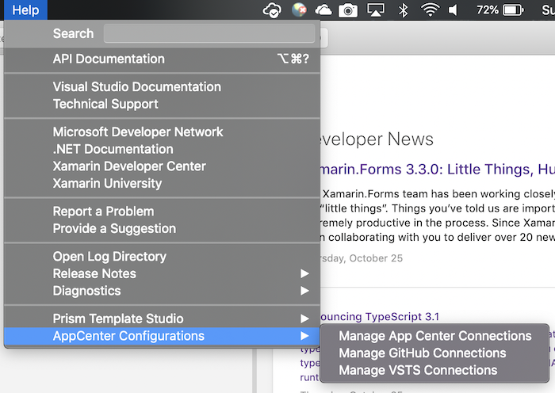

# Productivity Tools
Prism now integrates with Visual Studio and Visual Studio for Mac to enable a highly productive developer workflow for creating WPF, UWP, and native iOS and Android applications using Xamarin.Forms. Jump start your Prism apps with code snippets, item templates, and project templates for your IDE of choice.

Available Tools:
- Prism Template Pack
- Prism Template Studio
- Prism Extensibility Pack

# Prism Template Pack
The Prism Template Pack contains a collection of snippets, item templates, and project templates for use with building WPF, and Xamarin.Forms applications using Prism.

### Snippets
- propp - Property, with a backing field, that depends on BindableBase
```cs
    private string _fieldName;
    public string PropertyName
    {
        get { return _fieldName; }
        set { SetProperty(ref _fieldName, value); }
    }
```
- cmd - Creates a DelegateCommand property with Execute method
```cs
    private DelegateCommand _fieldName;
    public DelegateCommand CommandName =>
        _fieldName ?? (_fieldName = new DelegateCommand(ExecuteCommandName));

    void ExecuteCommandName()
    {

    }
```
- cmdfull - Creates a DelegateCommand property with Execute and CanExecute methods
```cs
    private DelegateCommand _fieldName;
    public DelegateCommand CommandName =>
        _fieldName ?? (_fieldName = new DelegateCommand(ExecuteCommandName, CanExecuteCommandName));

    void ExecuteCommandName()
    {

    }

    bool CanExecuteCommandName()
    {
        return true;
    }
```
- cmdg - Creates a generic DelegateCommand<T> property
```cs
    private DelegateCommand<string> _fieldName;
    public DelegateCommand<string> CommandName =>
        _fieldName ?? (_fieldName = new DelegateCommand<string>(ExecuteCommandName));

    void ExecuteCommandName(string parameter)
    {

    }
```
- cmdgfull - Creates a generic DelegateCommand<T> property with Execute and CanExecute methods
```cs
    private DelegateCommand<string> _fieldName;
    public DelegateCommand<string> CommandName =>
        _fieldName ?? (_fieldName = new DelegateCommand<string>(ExecuteCommandName, CanExecuteCommandName));

    void ExecuteCommandName(string parameter)
    {

    }

    bool CanExecuteCommandName(string parameter)
    {
        return true;
    }
```

### Item Templates
**Cross Platform**
- Prism ViewModel - A ViewModel that derives from BindableBase and has a default constructor.

**WPF**
- Prism UserControl - UserControl with ViewModel
- Prism Window - Window with ViewModel

**Xamarin.Forms**
- Prism ContentPage - ContentPage with ViewModel & Auto-registration
- Prism NavigationPage - NavigationPage with ViewModel & Auto-registration
- Prism MasterDetailPage - MasterDetailPage with ViewModel & Auto-registration
- Prism TabbedPage - TabbedPage with ViewModel & Auto-registration
- Prism CarouselPage - CarouselPage with ViewModel & Auto-registration

### Project Templates
**WPF**
- Prism Blank App - this is a project template that essentially creates a new WPF shell application.  It will have a basic bootstrapper that is responsible for initializing the app, and showing the shell.  It will have a MainWindow and a MainWindowViewModel located in the Views and ViewModels folders respectively.
- Prism Module - this project template will add a new project to your solution that will act as a Prism module.  It will have a class defined that implements IModule with two empty folders for your Views and ViewModels.

Use the new WPF project wizard to choose your container and no longer have to worry about bringing in the correct Nuget packages.


**Xamarin.Forms**
- Prism Blank App - this project template will create a .NET Standard Xamarin.Forms application with four projects; .NET Standard project for the shared code, an iOS app, an Android app, and a UWP app.
- Prism Module - this project template will add a new project to your solution that will act as a Prism module.  It will have a class defined that implements IModule with two folders for your Views and ViewModels.  There will be a default view called ViewA and a class named ViewAViewModel that has already been registered with the container in the IModule class.

Tired of creating every Xamarin.Forms platform project available? Now you can chose only the projects you care about with the new Xamarin.Forms Project Wizard.


## Visual Studio Installation
The Prism Template Pack is available on the [Visual Studio Gallery](https://marketplace.visualstudio.com/items?itemName=BrianLagunas.PrismTemplatePack). To install in Visual Studio 2019, just go to `Visual Studio -> Extensions -> ManageExtensions -> Online -> Visual Studio Marketplace` then search for "Prism Template Pack" in the online gallery:


# Prism Template Studio

The Prism Template Studio contains a collection of snippets, item templates, and project templates for use with Xamarin.Forms applications using Prism with Visual Studio for Mac.

> [!WARNING]
> The Prism Template Studio for Visual Studio Mac is not compatibile with Visual Studio Mac 8.X. Work is currently being done to bring this up to date and provide the full functionality in Visual Studio on Windows, however it will only be available for those [sponsoring Dan on GitHub](https://xam.dev/sponsordan).

### Snippets

- propp - Property, with a backing field, that depends on BindableBase
```cs
    private string _fieldName;
    public string PropertyName
    {
        get { return _fieldName; }
        set { SetProperty(ref _fieldName, value); }
    }
```
- cmd - Creates a DelegateCommand property with Execute method
```cs
    private DelegateCommand _fieldName;
    public DelegateCommand CommandName =>
        _fieldName ?? (_fieldName = new DelegateCommand(ExecuteCommandName));

    void ExecuteCommandName()
    {

    }
```
- cmdfull - Creates a DelegateCommand property with Execute and CanExecute methods
```cs
    private DelegateCommand _fieldName;
    public DelegateCommand CommandName =>
        _fieldName ?? (_fieldName = new DelegateCommand(ExecuteCommandName, CanExecuteCommandName));

    void ExecuteCommandName()
    {

    }

    bool CanExecuteCommandName()
    {
        return true;
    }
```
- cmdg - Creates a generic DelegateCommand<T> property
```cs
    private DelegateCommand<string> _fieldName;
    public DelegateCommand<string> CommandName =>
        _fieldName ?? (_fieldName = new DelegateCommand<string>(ExecuteCommandName));

    void ExecuteCommandName(string parameter)
    {

    }
```
- cmdgfull - Creates a generic DelegateCommand<T> property with Execute and CanExecute methods
```cs
    private DelegateCommand<string> _fieldName;
    public DelegateCommand<string> CommandName =>
        _fieldName ?? (_fieldName = new DelegateCommand<string>(ExecuteCommandName, CanExecuteCommandName));

    void ExecuteCommandName(string parameter)
    {

    }

    bool CanExecuteCommandName(string parameter)
    {
        return true;
    }
```

### Item Templates
TODO

### Project Templates
- Blank Prism Application - This project template will create a .NET Standard Xamarin.Forms application with three projects; a .NET Standard project for the shared code, an iOS app, and an Android app.


- QuickStart Blank Prism Application - This template lets you create a Xamarin.Forms app for iOS and Android much like the Visual Studio for Windows template, but adds PropertyChanged.Fody, started icon assets, IDE configurations and option to incude UI tests.


- QuickStart Prism Application - This template provides a customizable template for creating Prism application with many common tools already installed e.g. MVVM helpers like Fody, localization, barcode scanner, and data provider backends (Azure, Realm, etc.)


> [!NOTE]
This template requires CI/CD setup for **AppCenter** and **Azure Devops (VSTS)**. To get started, go to [App Center](https://docs.microsoft.com/en-us/appcenter/) and [Azure DevOps](https://visualstudio.microsoft.com/vso/) to setup your app. Then create connection to your app in Visual Studio for Mac by going to `Help -> AppCenter Configurations`.

Tutorial for this QuickStart can be found [here](https://dansiegel.net/post/2018/06/21/developer-toolkit-for-visual-studio-mac).

- Module - this project template will add a new project to your solution that will act as a Prism module.  It will have a class defined that implements IModule with two empty folders for your Views and ViewModels.
- Test - contains templates for Appium and Xamarin UI test, and Unit tests in MS Test, NUnit, and Xunit.

## Visual Studio for Mac Installation
The Prism Template Studio and Developer Toolkit is available from the Visual Studio Mac Extensions Gallery. Prism makes it easier to get Prism Template Studio and Developer Toolkit all in a single extension. Go to `Visual Studio -> Extensions...` and search for "Prism" in the Gallery tab.


