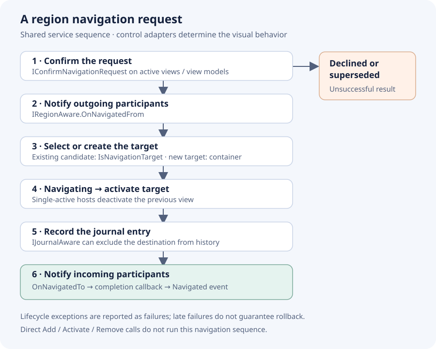

# View and View Model Participation in Navigation

Implement `Prism.Navigation.Regions.IRegionAware` on a view model to receive region navigation callbacks. Prism also checks the view. WPF, Uno and Avalonia use `DataContext`; MAUI uses `BindingContext`.

```csharp
public interface IRegionAware
{
    bool IsNavigationTarget(NavigationContext navigationContext);
    void OnNavigatedFrom(NavigationContext navigationContext);
    void OnNavigatedTo(NavigationContext navigationContext);
}
```

WPF and Avalonia retain a legacy region `INavigationAware` interface that inherits `IRegionAware`. Use `IRegionAware` in new shared region code. MAUI page `Prism.Navigation.INavigationAware` is a separate contract with different arguments.

## Example: receive a customer identifier

```csharp
using System;
using Prism.Mvvm;
using Prism.Navigation.Regions;

public sealed class CustomerViewModel : BindableBase, IRegionAware
{
    private string _customerId = string.Empty;
    public string CustomerId
    {
        get => _customerId;
        private set => SetProperty(ref _customerId, value);
    }

    public bool IsNavigationTarget(NavigationContext context) => true;

    public void OnNavigatedTo(NavigationContext context)
    {
        if (!context.Parameters.TryGetValue<string>("customerId", out var id)
            || string.IsNullOrWhiteSpace(id))
            throw new ArgumentException("A customerId is required.");

        CustomerId = id;
    }

    public void OnNavigatedFrom(NavigationContext context)
    {
        // Snapshot transient UI state if the application needs it.
    }
}
```

`IsNavigationTarget` returning `true` permits reuse. `OnNavigatedTo` must therefore handle new parameters on an existing instance, not only initial construction. See [Navigating to Existing Views](navigation-existing-views.md) for one-instance-per-record behavior.

## Navigation order



*Region navigation sequence. A rejected or superseded confirmation reports an unsuccessful result before the target is activated.*

1. The active views and their view models can [confirm the request](confirming-navigation.md).
2. Prism calls `OnNavigatedFrom` on active participants.
3. The content loader checks candidate views with `IsNavigationTarget`, or resolves a new view and its view model.
4. `Navigating` is raised just before target activation.
5. Prism activates the target. A single-active region deactivates its previous view, invoking any applicable lifetime policy.
6. The region journal is updated.
7. Prism calls `OnNavigatedTo` on the target's participating view and view model.
8. The completion callback runs, then the navigation service raises `Navigated`.

Adapters can react to a new view being added during content loading, including activating the first item in an empty content region. The sequence above describes the navigation service’s explicit activation step.

`IsNavigationTarget` is a reuse decision for candidate instances, not a veto on leaving the current view. `OnNavigatedFrom` cannot cancel navigation. A new view does not need to pass an existing-instance reuse check.

## Keep lifecycle work bounded

These methods are synchronous. An `async void OnNavigatedTo` returns to Prism at the first incomplete await, so a successful navigation result does not mean its data load succeeded. Use an explicit asynchronous loading operation with observed errors, cancellation and loading state. If navigation away must wait for a decision or save, coordinate that through `IConfirmNavigationRequest` instead.

Do not duplicate a side effect on both view and view model: both may receive the callback. Do not assume failure restores the prior UI; `OnNavigatedFrom` or activation may already have happened before a later exception is reported.

Source: [IRegionAware](https://github.com/PrismLibrary/Prism/blob/b8f00b5091063feea127a2417fc72d6b299ee16c/src/Prism.Core/Navigation/Regions/IRegionAware.cs), [desktop sequence](https://github.com/PrismLibrary/Prism/blob/b8f00b5091063feea127a2417fc72d6b299ee16c/src/Wpf/Prism.Wpf/Navigation/Regions/RegionNavigationService.cs), [MAUI sequence](https://github.com/PrismLibrary/Prism/blob/b8f00b5091063feea127a2417fc72d6b299ee16c/src/Maui/Prism.Maui/Navigation/Regions/Navigation/RegionNavigationService.cs).
