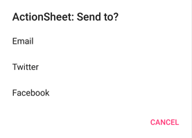

# ActionSheets

An ActionSheet presents the user with a set of alternatives for how to proceed with a task. To display an ActionSheet you can use the `IActionSheet` directly or you can use the aggregate `INotifications` interface as follows:

```cs
await notifications.ActionSheet.DisplayAsync("Send to:", 
    ActionSheetButton.CreateButton("Email", SendEmail),
    ActionSheetButton.CreateButton("Twitter", SendTweet),
    ActionSheetButton.CreateButton("Facebook Messenger", SendFacebookMessage));
```



ActionSheets also provide the capability to provide an explicit Cancel or Destroy button.
