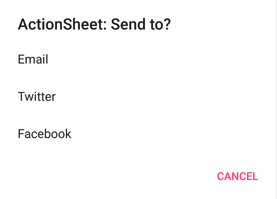

# Action sheets

`IActionSheet` presents named choices and runs the selected button's callback. Obtain it directly or through `INotifications.ActionSheet` after [notification registration](index.md).

```csharp
using Prism.Plugin.Essentials.Notifications;

public sealed class ExportChoices(IActionSheet actionSheet)
{
    public Task ShowAsync(Func<Task> exportCsv, Func<Task> exportPdf) =>
        actionSheet.DisplayAsync("Export format",
            ActionSheetButton.CreateButton("CSV", exportCsv),
            ActionSheetButton.CreateButton("PDF", exportPdf),
            ActionSheetButton.CreateCancelButton("Cancel"));
}
```

`exportCsv` and `exportPdf` are application-owned asynchronous actions. `CreateButton`, `CreateCancelButton`, and `CreateDestroyButton` have callback overloads; generic overloads accept a callback and its parameter. Use a `Func<Task>` for asynchronous work rather than an `async void` action. Put operation-level error handling inside the application's asynchronous action.



The core method returns `Task`, not a selected button value. A separate `NotificationExtensions.DisplayAsync` overload accepts cancel/destroy/other button labels and returns the selected label. Do not mix those two calling conventions. A destructive label is presentation, not business authorization or an undo policy.

Action-sheet services are transient. Invoke them on the active UI after the Activity/window is ready, avoid overlapping presentation, and keep callbacks from retaining a screen beyond its lifetime. The public contract has no cancellation token; cancellation of application work does not promise dismissal of the native sheet. Actual button ordering/appearance is host-specific. See [host capabilities](../platform-support.md).

## Source reference

The following pinned Prism source links require authorized access to the private Prism.Plugins repository. Package availability must be checked in your authorized feed.

- [`src/Prism.Plugin.Essentials/Notifications/IActionSheet.cs`](https://github.com/PrismLibrary/Prism.Plugins/blob/f0abcbb95c9e865dc909966cfe8ad9883c42d5d5/src/Prism.Plugin.Essentials/Notifications/IActionSheet.cs)
- [`src/Prism.Plugin.Essentials/Notifications/ActionSheetButton.cs`](https://github.com/PrismLibrary/Prism.Plugins/blob/f0abcbb95c9e865dc909966cfe8ad9883c42d5d5/src/Prism.Plugin.Essentials/Notifications/ActionSheetButton.cs)
- [`src/Prism.Plugin.Essentials/Notifications/NotificationExtensions.cs`](https://github.com/PrismLibrary/Prism.Plugins/blob/f0abcbb95c9e865dc909966cfe8ad9883c42d5d5/src/Prism.Plugin.Essentials/Notifications/NotificationExtensions.cs)
