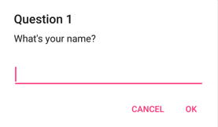

# Prompts

To display a prompt you can use the `IPrompts` interface directly or the aggregate `INotifications` as follows:

```cs
var value = await notifications.Prompts.DisplayAsync("Question", "What's your name?");
```



The Display method also provides additional optional parameters:

- `accept` - the text for the accept button.
- `cancel` - the text for the cancel button.
- `placeholder` - the placeholder text to display in the user prompt.
- `maxlength` - the max length of the user's response.
- `keyboard` - the keyboard type to use. This is provided via an enum value.
- `initialValue` - a predefined default value for the user to provide.
