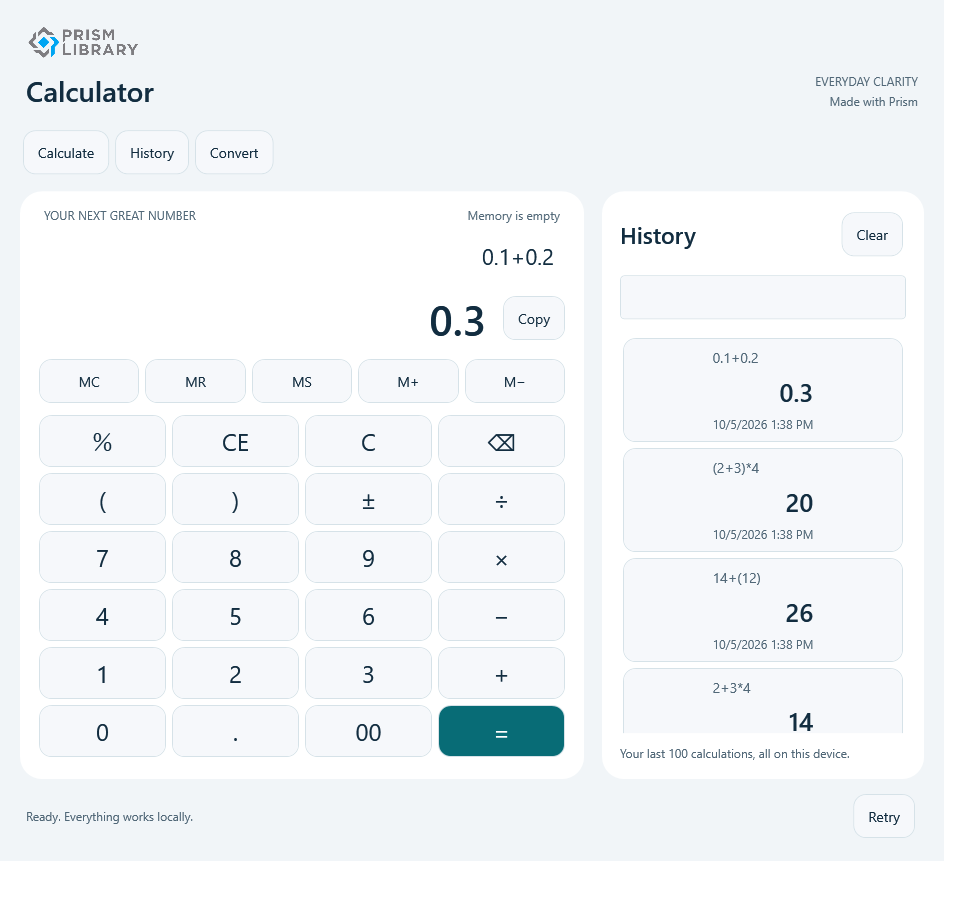

# Calculator

A useful first stop: enter an expression, reuse a result from history, then switch to unit conversion. The application keeps arithmetic and session state in shared .NET code while each head chooses how to arrange the work.

*WPF runtime test render, light theme, source `89f3a5b`. Original application-owned image; [capture provenance](runtime-coverage.md).*

## Try the workflow

1. Evaluate `2 + 3 * 4`, then press equals again. The results are `14` and `26`, showing precedence and repeat-equals behavior.
2. Evaluate `0.1 + 0.2`. Decimal arithmetic produces `0.3`.
3. Open a history item, cancel its dialog, then reopen and reuse its exact result.
4. Convert metres to kilometres, or compare decimal SI storage units with binary IEC units.

The percentage contract is explicit: `%` divides the preceding value by 100. History contains successful calculations only. Overflow, division by zero, unsupported input, and clipboard failures remain visible errors rather than invented successful results.

## Follow the application layer

[CalculationSession](https://github.com/PrismLibrary/samples/blob/9c31a9ce1a1fd55cc15c2cba4fc4a6338fd98b57/samples/prism-calculator/Shared/CalculationCore/Services/CalculationSession.cs) owns the current expression, result, memory, and history relationship. [ExpressionEvaluator](https://github.com/PrismLibrary/samples/blob/9c31a9ce1a1fd55cc15c2cba4fc4a6338fd98b57/samples/prism-calculator/Shared/CalculationCore/Services/ExpressionEvaluator.cs) owns arithmetic rules. The [calculator view model](https://github.com/PrismLibrary/samples/blob/9c31a9ce1a1fd55cc15c2cba4fc4a6338fd98b57/samples/prism-calculator/Shared/CalculationCore/ViewModels/CalculatorViewModel.cs) exposes commands and state without knowing any native control type.

The on-demand relationship is **History → CalculationCore**. **UnitConversion** is independent and can load first in a fresh container. `FeatureLoader` awaits initialization and checks the dependency graph before navigation; reopening a feature does not recreate the shared calculation session.

## Compare the heads

### WPF: a second region when there is room

The shell's wide layout includes a history region beside the calculator. Compact layout uses the main region for navigation while retaining the same session. Explicit view/view-model mappings keep construction under Prism's container. Native dialog tests cover history reuse and confirmation cancellation.

Follow [WPF startup](https://github.com/PrismLibrary/samples/blob/9c31a9ce1a1fd55cc15c2cba4fc4a6338fd98b57/samples/prism-calculator/WPF/PrismCalculator.Wpf/PrismStartup.cs).

### MAUI: compose once, adapt the native view

`MauiProgram` passes a `MicrosoftContainerExtension` to `UsePrism`, delegates service and module registration to `PrismStartup`, and navigates to the logical shell route. The shared calculator logic remains unchanged; the head owns its page, region views, controls, and native lifetime.

Follow [MAUI composition](https://github.com/PrismLibrary/samples/blob/9c31a9ce1a1fd55cc15c2cba4fc4a6338fd98b57/samples/prism-calculator/Maui/PrismCalculator.Maui/MauiProgram.cs).

### Uno: the same routes in a different host

The Uno application resolves a registered shell and maps the same calculator/history/conversion routes to Uno views. Desktop, browser, Android, and WinUI are separately declared targets. Use the appropriate startup profile; the WPF image above is not a picture of those targets.

Follow [Uno startup](https://github.com/PrismLibrary/samples/blob/9c31a9ce1a1fd55cc15c2cba4fc4a6338fd98b57/samples/prism-calculator/Uno/PrismCalculator.Uno/PrismStartup.cs).

## Essentials, persistence, and visual identity

The heads register Essentials clipboard and version-tracking services. `CalculatorStore` writes a versioned snapshot through `IKeyValueStoreFactory` using generated JSON metadata. Corrupt or newer-format saved data is retained, with a temporary-session warning. Cancelling a clipboard wait does not promise to undo an OS operation already underway.

The application has a custom calculator icon composed from the authorized Prism mark and an equals badge. Its source and native PNG/ICO variants live in [Assets](https://github.com/PrismLibrary/samples/tree/9c31a9ce1a1fd55cc15c2cba4fc4a6338fd98b57/samples/prism-calculator/Assets). This is distinct from replacing Prism's official brand mark.

## Workflow diagnostics

[CalculatorState](https://github.com/PrismLibrary/samples/blob/9c31a9ce1a1fd55cc15c2cba4fc4a6338fd98b57/samples/prism-calculator/Shared/CalculationCore/Services/CalculatorState.cs) receives `ILogger<CalculatorState>` and records history restore/save/clear, preference saves, and protected-store skips. A failed restore or write is distinct from success; a protected store is reported as skipped rather than overwritten. Expression text and history values do not enter the output. All three heads use the [filtered local Prism Logging composition](index.md#diagnose-real-workflows-with-prism-logging).

## Run and verify

Use the exact head paths and commands in the [Calculator README](https://github.com/PrismLibrary/samples/blob/9c31a9ce1a1fd55cc15c2cba4fc4a6338fd98b57/samples/prism-calculator/README.md). Portable tests cover arithmetic, cultures, repeat equals, state, cancellation, persistence, and UI-free dependencies. WPF tests exercise actual module, region, and dialog behavior. See the [capture matrix](runtime-coverage.md) for platform-specific runtime evidence and the [NativeAOT boundary](index.md#nativeaot-and-production-boundaries).
