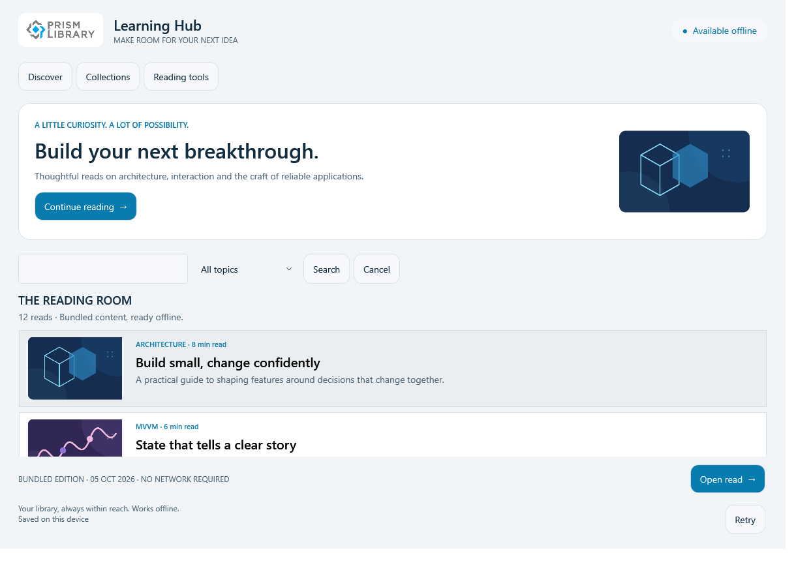
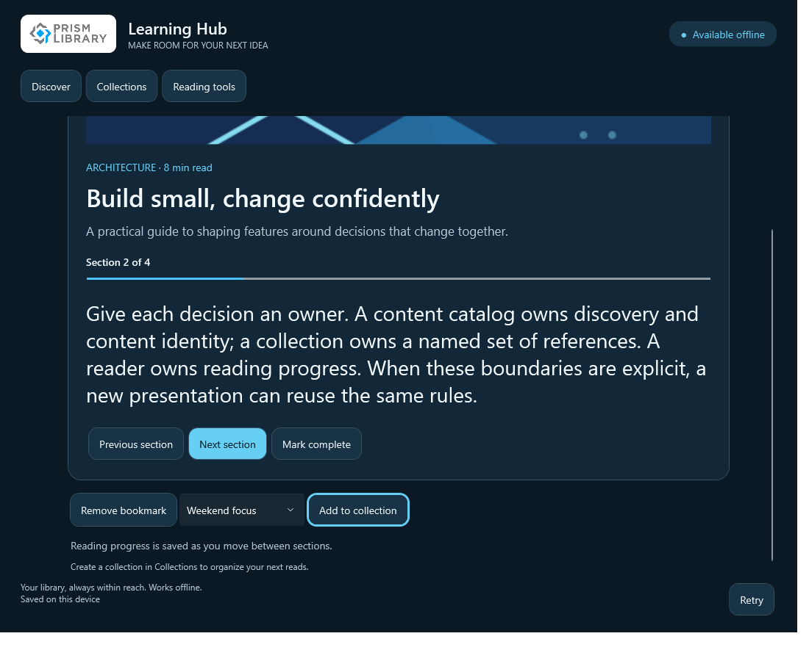

# Learning Hub

A complete offline reading experience: discover a short essay, save it to a collection, and return to the section where you stopped. Original illustrations and comfortable reading controls give the shared application model something useful to support.

*WPF runtime test render, light theme, source `dc814b3`. Original application-owned image; [capture provenance](runtime-coverage.md).*

The bundled catalog contains twelve original essays and five original topic illustrations. It is an essay reader, not a course service or video player. No account, API key, media backend, or external content download is needed.

## Try the workflow

1. Search by text and topic, cancel a search, then clear the query to restore the local catalog.
2. Open an essay, advance a section, bookmark it, and return later to its saved progress.
3. Create a collection and add the current essay from the reader. Rename the selected collection without losing the selection.
4. Change text size and appearance in Reading tools. Open that feature first in a fresh session to see its independent module initialization.

*The same WPF source checkpoint, scrolled reader with large text. The image shows the lower reading actions and retained collection selection; it is not a mobile capture.*

## Follow the application layer

[CatalogViewModel](https://github.com/PrismLibrary/samples/blob/88efab29a85f986877ec4cff7bc37770c0d4327b/samples/prism-learning-hub/Shared/ContentCatalog/ViewModels/CatalogViewModel.cs) owns search cancellation and a request generation. Only the newest live request can update results, errors, or busy state, including when a source ignores cancellation. [LearningSession](https://github.com/PrismLibrary/samples/blob/88efab29a85f986877ec4cff7bc37770c0d4327b/samples/prism-learning-hub/Shared/Settings/Services/LearningSession.cs) owns bookmarks, collections, preferences, and reading progress independently of transient views.

The on-demand graph is **Collections → ContentCatalog**, with **ReadingTools** independent. Heads map `Learning.*` routes and dialog keys to native views. Collection editing uses a draft and explicit dialog result; dirty cancellation offers Keep editing or Discard.

## Compare the heads

### WPF: reading state and bounded controls

The WPF shell uses a root region and native dialog window. Bounded, virtualizing catalog lists avoid an ever-growing stack of cards. Runtime tests inspect actual image decoding, selected-item focus, scrolling, collection edits, and large-text reader actions. These are in-process controls tests, not screen-reader certification.

Follow [WPF startup](https://github.com/PrismLibrary/samples/blob/88efab29a85f986877ec4cff7bc37770c0d4327b/samples/prism-learning-hub/WPF/PrismLearningHub.Wpf/PrismStartup.cs).

### MAUI: touch-friendly discovery and reading

The MAUI builder selects the Microsoft container and registers a logical shell route. Native pages and region views own layout, font sizing, and platform appearance; the shared session retains progress and collections across presentation changes.

Follow [MAUI composition](https://github.com/PrismLibrary/samples/blob/88efab29a85f986877ec4cff7bc37770c0d4327b/samples/prism-learning-hub/Maui/PrismLearningHub.Maui/MauiProgram.cs).

### Uno: native XAML for each application head

Uno registers its own shell and feature views while using the same catalog, session, and module graph. The compiled view templates and image presentation belong to the Uno head, so native WinUI build results must not be advertised as browser or Linux interaction results.

Follow [Uno startup](https://github.com/PrismLibrary/samples/blob/88efab29a85f986877ec4cff7bc37770c0d4327b/samples/prism-learning-hub/Uno/PrismLearningHub.Uno/PrismStartup.cs).

## Essentials and original artwork

[LearningStore](https://github.com/PrismLibrary/samples/blob/88efab29a85f986877ec4cff7bc37770c0d4327b/samples/prism-learning-hub/Shared/Settings/Services/LearningStore.cs) stores a versioned, generated-JSON snapshot through Essentials settings. Progress is persisted before the UI claims success. A failed write retains the previous state; unreadable or unsupported stored data pauses writes instead of resetting the library.

The [original SVG illustrations and bounded raster assets](https://github.com/PrismLibrary/samples/tree/88efab29a85f986877ec4cff7bc37770c0d4327b/samples/prism-learning-hub/Assets) are bundled with the app. A failed image retains the topic and title text. The fixed publication date describes this local edition; it is not presented as a recent remote synchronization.

## Run and verify

Use the [Learning Hub README](https://github.com/PrismLibrary/samples/blob/88efab29a85f986877ec4cff7bc37770c0d4327b/samples/prism-learning-hub/README.md). Portable tests cover out-of-order search, cancellation, state restoration, collection drafts, persistence failures, and UI-free dependencies. Native WPF tests exercise real routes, dialogs, bindings, virtualized lists, and the selected-collection regression.

See [runtime capture coverage](runtime-coverage.md) and the [NativeAOT boundary](index.md#nativeaot-and-production-boundaries).
