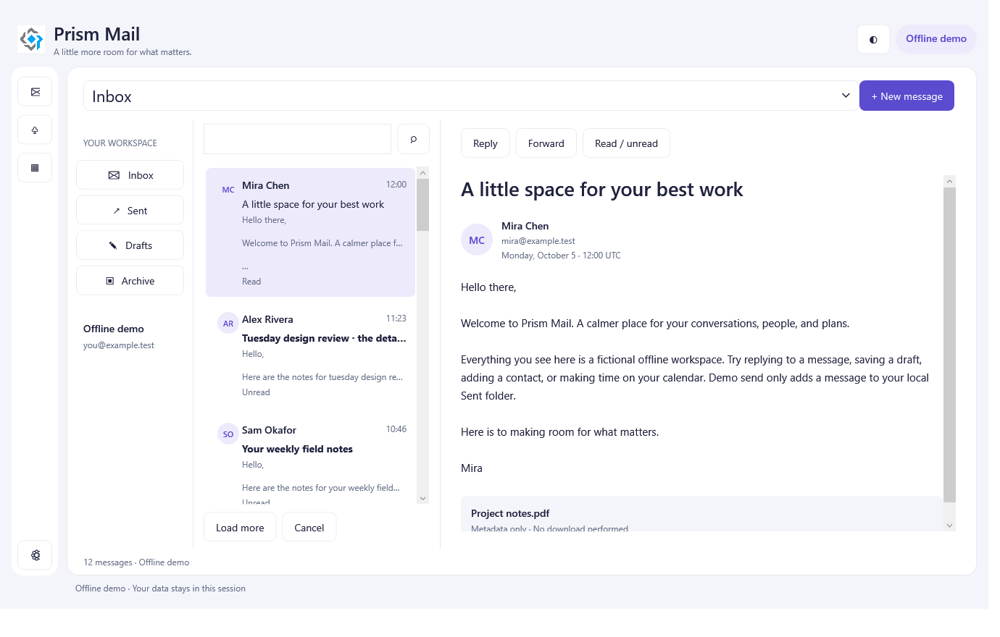
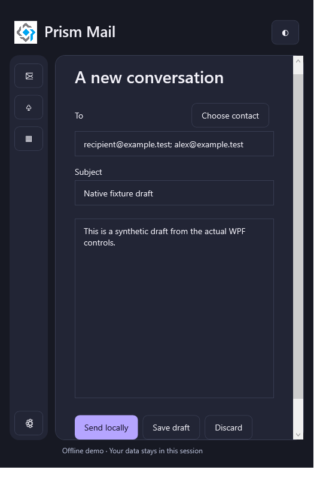

# Mail

A client-only reference application with a useful fictional inbox, contacts, calendar, and editable drafts. The offline journey is available without credentials; configured provider integration is a separate, deliberately bounded part of the sample.

:::note Review sample
Mail is under review in [samples PR #9](https://github.com/PrismLibrary/samples/pull/9). The walkthrough follows source `4ec97be`; the images identify their earlier verified runtime checkpoint. This page does not imply that the branch has merged or that live providers have been qualified.
:::

*WPF runtime test render, source `53894e9`, synthetic offline data. Original application-owned image; [capture provenance](runtime-coverage.md).*

## Try the offline workflow

1. Search mail, load another page, and toggle a message's read state.
2. Reply or forward, choose a recipient from Contacts, save a draft, and reopen it.
3. Change a dirty draft and cancel closure. The confirmation must preserve the draft when you choose Keep editing.
4. Switch to Calendar and inspect day, week, and agenda ranges using the explicit UTC fixture times.

Demo sends only add a message to the in-memory Sent folder. Contacts, calendar events, and drafts last for that demo session. No real mailbox is accessed, and attachment rows display metadata without automatically downloading a file.

*Compact WPF compose runtime render from the same checkpoint. A compact window is not an Android screenshot.*

## Follow the application and provider boundaries

`Shared` contains the UI-free contracts, view models, logical `MailRoutes`, and module coordination. `Providers` contains separate demo, Microsoft, Google, and MailKit transport implementations. Heads own presentation, public build configuration, host authorization services, and view registrations.

The on-demand graph is **Mail → Contacts**, with **Calendar** independent. Recipient selection motivates the dependency. `ModuleActivation` awaits completion and validates the complete dependency set before navigating.

A shared `WorkspaceSession` owns account transitions. It cancels stale reads, clears account-scoped cached state, and binds delayed confirmations to the account revision. Switching is blocked during a save or send. The reader displays plain text rather than running message HTML in a WebView; remote tracking images and active content are not fetched automatically.

Follow the [reviewed source and provider boundaries](https://github.com/PrismLibrary/samples/blob/4ec97be72f11357c74ee616573a74a03adeb513c/samples/prism-mail/README.md).

## Compare the heads

### WPF: a three-pane workspace and native dialogs

The WPF head combines folders, a message list, and a reader, with separate compact flows. Native dialog views handle recipients and discard confirmation. The runtime tests use fake accounts and isolated stores, so account-boundary behavior can be exercised without signing into a real provider.

Follow [WPF composition](https://github.com/PrismLibrary/samples/blob/4ec97be72f11357c74ee616573a74a03adeb513c/samples/prism-mail/WPF/PrismMail/PrismStartup.cs).

### MAUI: offline behavior first

The MAUI head maps the same shared routes and feature modules to native page/region views. It starts in demo mode. The current mobile authorization integrations are incomplete and must not be replaced with an assumed desktop loopback flow or an embedded provider password form.

Follow [MAUI composition](https://github.com/PrismLibrary/samples/blob/4ec97be72f11357c74ee616573a74a03adeb513c/samples/prism-mail/Maui/PrismMail/PrismStartup.cs).

### Uno: browser and desktop capabilities differ

Uno supplies its own shell, resources, and route/dialog registrations. The browser head cannot be treated as a raw-socket IMAP/SMTP desktop client. Current browser sign-in remains unavailable; a successful offline browser workflow would qualify that demo journey only.

Follow [Uno composition](https://github.com/PrismLibrary/samples/blob/4ec97be72f11357c74ee616573a74a03adeb513c/samples/prism-mail/Uno/PrismMail/PrismStartup.cs).

## Typed configuration and Essentials

The heads use the actual project-keyed Mobile.BuildTools AppSettings schema. Safe dummy public-client values keep a clean checkout in offline mode. Generated settings are converted into typed, validated provider options. Build-time injection keeps inputs out of Git; constants in a distributed application are not secret storage.

Never put client secrets, passwords, access tokens, or refresh tokens into generated build settings. Developers who choose live mode supply their own appropriate public-client registration and redirects. Ordinary demo usage requires none of that setup.

Essentials supplies platform services and the generated secure-store manifest contract. The token store explicitly requires the secure backend and fails closed rather than falling back to preferences. Fake-store tests do not qualify every OS keychain. Official Microsoft/Google sign-in button assets are provider branding, not a distinct Mail app icon or original application illustration.

## Provider and verification limits

- Live provider interoperability has not been qualified by the offline tests or these screenshots.
- Android, iOS, and browser authorization remain incomplete; runtime IMAP connection UI also remains incomplete.
- The provider contracts intentionally refuse unsupported writes and ambiguous retries. An uncertain send is not automatically retransmitted, and transport acceptance is not proof of delivery.
- WPF workflow tests and portable provider tests do not establish full MAUI/Uno interactive or NativeAOT qualification.

Use the [Mail README](https://github.com/PrismLibrary/samples/blob/4ec97be72f11357c74ee616573a74a03adeb513c/samples/prism-mail/README.md) for the current detailed setup and safety boundaries, then consult [runtime capture coverage](runtime-coverage.md) and the [NativeAOT guide](../dependency-injection/native-aot.md).
