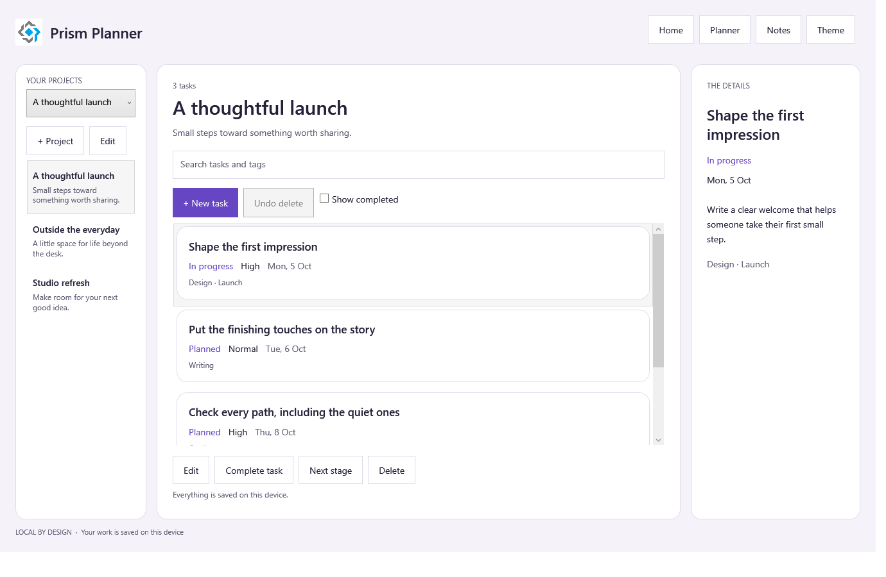

# Planner

A local-first project and task workspace with a separate personal-notes feature. Its most useful lesson is what happens when an edit is cancelled, a save fails, or several dirty documents need to close together.

*WPF runtime test render, light theme, source `7ffdd4c`. Original application-owned image; [capture provenance](runtime-coverage.md).*

## Try the workflow

1. Open Notes first and check the initialized-module indicators. PersonalNotes can load without ProjectCatalog.
2. Open Planner. ProjectCatalog initializes before PlanningBoard.
3. Add or edit a task, including priority, stage, due date, and tags. Invalid input keeps the editor open.
4. Cancel a dirty editor and choose Keep editing or Discard. Delete with confirmation, then undo the deletion.

The workspace persists a proposed snapshot before publishing the change to its view models. A failed or cancelled save cannot be presented as a completed edit.

## Follow the application layer

[PlannerWorkspace](https://github.com/PrismLibrary/samples/blob/9c31a9ce1a1fd55cc15c2cba4fc4a6338fd98b57/samples/prism-planner/Shared/Storage/Services/PlannerWorkspace.cs) owns transactions. [LocalPlannerStore](https://github.com/PrismLibrary/samples/blob/9c31a9ce1a1fd55cc15c2cba4fc4a6338fd98b57/samples/prism-planner/Shared/Storage/Services/LocalPlannerStore.cs) writes an app-owned snapshot through a same-directory temporary file and atomic replacement. [CloseAllCoordinator](https://github.com/PrismLibrary/samples/blob/9c31a9ce1a1fd55cc15c2cba4fc4a6338fd98b57/samples/prism-planner/Shared/Editing/CloseAllCoordinator.cs) collects dirty-close decisions before committing them.

The on-demand graph is **PlanningBoard → ProjectCatalog**, with **PersonalNotes** independent. Shared routes such as `Planner.Projects`, `Planner.Tasks`, and `Planner.TaskDetails` identify application intent. Head-owned adapters select the native view and region.

## Compare the heads

### WPF: desktop editing and window closure

The desktop head combines project, board, and detail regions. It owns keyboard bindings and native dialog windows. Its window-close path coordinates dirty documents before discarding any, so cancelling a later confirmation does not silently lose an earlier edit.

Follow [WPF startup and registrations](https://github.com/PrismLibrary/samples/blob/9c31a9ce1a1fd55cc15c2cba4fc4a6338fd98b57/samples/prism-planner/WPF/PrismPlanner.Wpf/PrismStartup.cs).

### MAUI: a native shell page and built-in dialog host

The MAUI head registers its shell with Prism page navigation, uses region composition inside that shell, and maps the same editor and confirmation contracts to MAUI views. Prism's built-in dialog container owns presentation; shared view models own validation and results.

Follow [MAUI composition](https://github.com/PrismLibrary/samples/blob/9c31a9ce1a1fd55cc15c2cba4fc4a6338fd98b57/samples/prism-planner/Maui/PrismPlanner.Maui/PrismStartup.cs).

### Uno: keep selection and state outside the view

Uno registers the same shared workspace and logical route contracts, then supplies its own XAML and region navigation adapter. Resizing or switching presentation does not make view objects the owners of task data. Test browser storage and native desktop behavior on their respective hosts.

Follow [Uno composition](https://github.com/PrismLibrary/samples/blob/9c31a9ce1a1fd55cc15c2cba4fc4a6338fd98b57/samples/prism-planner/Uno/PrismPlanner.Uno/PrismStartup.cs).

## Essentials and app-owned storage

Each head registers `PlannerJsonContext`, the generated `IPlannerPreferences` store, and Essentials `IFileSystem`. WPF sets a stable application identity before other store registrations. Durable task data uses `AppData`; appearance preferences use the small settings contract. Versioned JSON supports the defined migration path without silently resetting corrupt or unsupported data.

The application includes an original [notebook-and-plant illustration](https://github.com/PrismLibrary/samples/blob/9c31a9ce1a1fd55cc15c2cba4fc4a6338fd98b57/samples/prism-planner/Assets/planner_garden.svg). Its app icon and splash currently use shared official Prism branding. The reference remains useful for transactional editing even where a head's visual treatment still needs further product polish.

## Workflow diagnostics

`PlannerWorkspace` receives `ILogger<PlannerWorkspace>`. Its [operation boundaries](https://github.com/PrismLibrary/samples/blob/9c31a9ce1a1fd55cc15c2cba4fc4a6338fd98b57/samples/prism-planner/Shared/Storage/Services/PlannerWorkspace.cs) distinguish load, task save/delete/undo, project saves, and note saves, with separate cancelled, rejected, failed, and successful outcomes. A retry records the later result without rewriting the earlier failure. Task titles, notes, and project data stay out of the [filtered local output](index.md#diagnose-real-workflows-with-prism-logging).

## Run and verify

Use the [Planner README](https://github.com/PrismLibrary/samples/blob/9c31a9ce1a1fd55cc15c2cba4fc4a6338fd98b57/samples/prism-planner/README.md). `PlannerTargetFrameworks` selects a bounded head target while the shared project remains plain .NET. Portable tests cover failed persistence, undo/retry, dates and validation, reentrancy, and coordinated close decisions. WPF tests exercise real modules, bound native controls, and dialogs in an isolated workspace.

See [runtime capture coverage](runtime-coverage.md) and the [NativeAOT boundary](index.md#nativeaot-and-production-boundaries).
