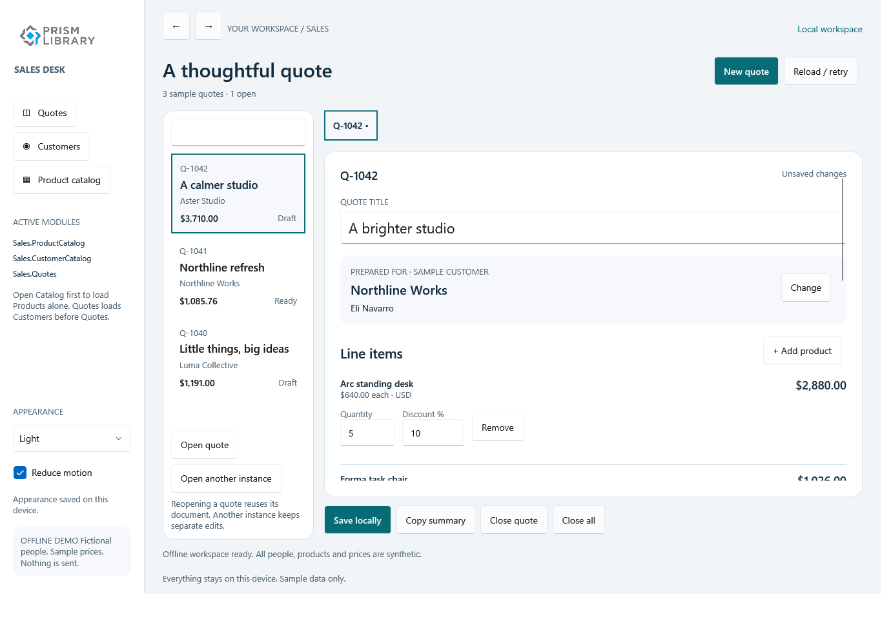

# Sales Desk

An offline workspace for fictional customers, products, and quotes. Open two revisions of the same quote and see how a desktop-style document workflow can preserve unsaved work without letting stale edits overwrite a newer save.

*WPF runtime test render from qualified tree `eae8063`, light theme. Original application-owned image; [capture provenance](runtime-coverage.md).*

All identities and prices are synthetic. Quote stages are local demo labels; this application does not place orders, accept contracts, send email, reserve stock, or take payment.

## Try the workflow

1. Open Product catalog first. Its independent module loads without CustomerCatalog.
2. Open Quotes. CustomerCatalog initializes before Quotes.
3. Open a quote, then choose **Open another instance** to create an independent editing session for the same saved document.
4. Save the first revision, then attempt to save the stale second revision. The conflict retains the second document's edits.
5. Make two documents dirty and choose Close all. Cancelling a later decision must leave earlier documents and saves untouched.

This is a quote editor, not an opportunity pipeline or a connected CRM dashboard.

## Follow the application layer

[QuoteRules](https://github.com/PrismLibrary/samples/blob/9c31a9ce1a1fd55cc15c2cba4fc4a6338fd98b57/samples/prism-sales-desk/Shared/Quotes/Services/QuoteRules.cs) owns decimal totals, validation, and local stage rules. [QuoteRepository](https://github.com/PrismLibrary/samples/blob/9c31a9ce1a1fd55cc15c2cba4fc4a6338fd98b57/samples/prism-sales-desk/Shared/Quotes/Services/QuoteRepository.cs) owns revisions and atomic snapshot commits. [QuotesViewModel](https://github.com/PrismLibrary/samples/blob/9c31a9ce1a1fd55cc15c2cba4fc4a6338fd98b57/samples/prism-sales-desk/Shared/Quotes/ViewModels/QuotesViewModel.cs) coordinates documents, awaited commands, owned cancellation, and reusable selection dialogs.

The module graph is **Quotes → CustomerCatalog**, with **ProductCatalog** independent. Adding a product explicitly loads the product feature when needed. `Sales.Quote`, `Sales.Customers`, and `Sales.SelectCustomer` remain logical keys; shared code has no reference to a head's view type.

## Compare the heads

### WPF: multiple documents and explicit close decisions

The shell combines feature navigation, quote selection, document tabs, and the active editor. Reopening an existing document reuses it; another instance intentionally owns separate edits. Native dialog results carry Save/Discard/Cancel decisions back to the shared workflow.

Follow [WPF composition](https://github.com/PrismLibrary/samples/blob/9c31a9ce1a1fd55cc15c2cba4fc4a6338fd98b57/samples/prism-sales-desk/WPF/PrismSalesDesk.Wpf/PrismStartup.cs).

### MAUI: preserve workspace identity across activation

The MAUI head supplies a registered shell page, native list/detail views, and a region adapter while keeping the quote workspace shared. Its existing Windows composition test verifies repeated startup/module activation retains the same unsaved workspace. That test is narrower than a complete touch or Android UI journey.

Follow [MAUI startup](https://github.com/PrismLibrary/samples/blob/9c31a9ce1a1fd55cc15c2cba4fc4a6338fd98b57/samples/prism-sales-desk/Maui/PrismSalesDesk.Maui/PrismStartup.cs).

### Uno: responsive regions and native bindings

The Uno shell maps the same logical routes and dialogs to Uno controls, with compact and wide layouts and theme resources. Compiled bindings and busy-state guards belong to this presentation head. Native WinUI, Desktop, and BrowserWasm still need independent runtime checks.

Follow [Uno startup](https://github.com/PrismLibrary/samples/blob/9c31a9ce1a1fd55cc15c2cba4fc4a6338fd98b57/samples/prism-sales-desk/Uno/PrismSalesDesk.Uno/PrismStartup.cs).

## Essentials and durable local state

Essentials supplies the clipboard, version tracking, file system, and small appearance preferences. [EssentialsQuoteStorage](https://github.com/PrismLibrary/samples/blob/9c31a9ce1a1fd55cc15c2cba4fc4a6338fd98b57/samples/prism-sales-desk/Shared/Quotes/Services/EssentialsQuoteStorage.cs) keeps bounded quote snapshots in `AppData`, rather than storing large documents in platform settings. Generated JSON metadata and atomic file replacement make the storage contract inspectable.

Clipboard output includes a sample-data disclaimer. A cancelled wait does not claim to roll back an OS clipboard write. Corrupt or unsupported saved state is surfaced without silently overwriting it. The reviewed app uses official shared Prism branding; a distinct app icon and original product artwork are not yet demonstrated here.

## Workflow diagnostics

`QuoteRepository` receives `ILogger<QuoteRepository>` and logs the [load and commit boundaries](https://github.com/PrismLibrary/samples/blob/9c31a9ce1a1fd55cc15c2cba4fc4a6338fd98b57/samples/prism-sales-desk/Shared/Quotes/Services/QuoteRepository.cs). Idempotent replay is `Replayed`, a stale revision is `Rejected`, and cancellation is separate from storage failure. These categories help explain a multi-document conflict without logging customer identities, document IDs, prices, or quote contents. Every head uses the [same local output filter](index.md#diagnose-real-workflows-with-prism-logging).

## Run and verify

Use the [Sales Desk README](https://github.com/PrismLibrary/samples/blob/9c31a9ce1a1fd55cc15c2cba4fc4a6338fd98b57/samples/prism-sales-desk/README.md). Portable tests cover arithmetic, stale revisions, batch atomicity, failures, retry, cancellation, and module boundaries. WPF runtime tests exercise bound controls, dialogs, document reuse, compact/wide layouts, and contrast checks. MAUI composition and Uno build evidence are documented separately from full interactive workflows.

See [runtime capture coverage](runtime-coverage.md) and the [NativeAOT boundary](index.md#nativeaot-and-production-boundaries).
