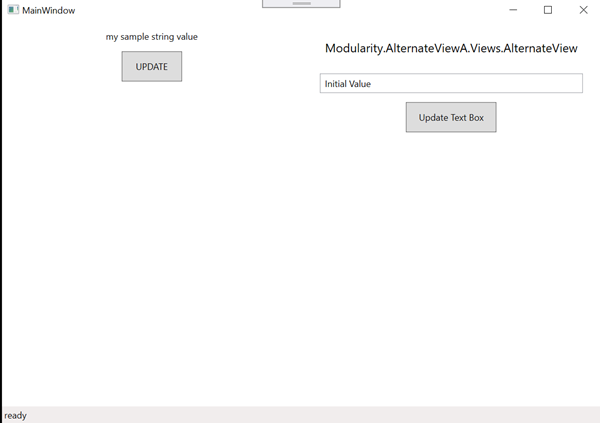
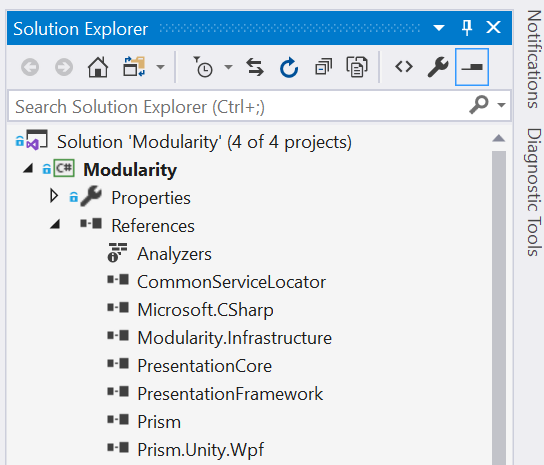

# Modules

It is often advantageous to build out an application in smaller blocks of functionality, with these blocks having no coupling to other parts of the application, or as little as possible. This will make maintainability easier and will also make it easier to perform automated tests.

Prism can help with this effort by providing the infrastructure to assemble your app into a cohesive functioning whole from disparate parts at runtime by using the Modularity services.

> To really use the power of Modularity in Prism, there are a few concepts that are often used in conjunction with. ```Dependency Injection``` reduces coupling between objects. [EventAggregation](../../../event-aggregator.md) is used to enable communication between components without knowing anything about the other components. [View composition](./view-composition.md) is used to compose user interfaces without knowing the implementation of each of the views. Some basics of using the three concepts are in this topic.


## Getting Started
The first thing is to explain the app architecture in the sample app.



In the app above, there are two main components. The first component is the main window that contains the controls on the left and the status bar at the bottom of the window. The second is the set of controls on the right containing the title, a text box and a button to update the text box.

Focusing on the left hand side, clicking on the button ```UPDATE``` will update the value in the text block above the button. It will also update the text in the status bar.

Focusing on the right hand side, it does much the same thing. Clicking on ```Update Text Box``` updates the value in the text box above the button. It also updates the status bar at the bottom of the main window.

The interesting thing about the app above is that the set of controls on the right are hosted in an assembly that is not referenced by the assembly containing the main window. It can be swapped out for something completely different without updating code or references for the main window assembly.

The other interesting thing is that the implementation that generates the new string values in the right hand set of controls, isn't referenced by any other assembly.

Here is how this app can be broken out into components.


| Component | Description |
|-----------|-------------|
| Modularity.Infrastructure.dll | This assembly is referenced by all the other components in the app. It only contains items such as abstract base classes, interfaces and data models. |
| Modularity.exe | This is the main app exe. It contains the main window and the controls that are on the left hand side. |
| Modularity.AlternateViewA.dll | This assembly contains the controls that are visible on the right hand side of the main window. It consumes strings from the Modularity.NewStringService without referencing the assembly and updates the status bar of the main window without any reference to that assembly. |
| Modularity.NewStringService.dll | This implements a service that provides string values. |

In the project .exe, here is what the project references look like. Notice that there are no other project references except for ```Modularity.Infrastructure```.



## Following Along In Code

All the code in this document can be found in [Prism Docuenation WpfSample repository](https://github.com/MichaelPonti/Prism-Documentation-WpfSample/tree/master/Modularity)

## The Infrastructure

```Modularity.Infrastructure.dll``` is the only assembly that is tightly coupled in the project. There is not much functionality in it, and instead just contains some base classes, event definitions and interfaces. It contains the ```BaseViewModel``` class that all app view models derive from. As such, it only contains common functionality such as updating the status bar. The main app exe has a reference to this assembly, but not to the others.

## Loading Dependent Assemblies

How does Prism help you achieve this? During its startup, it loads up a module catalog. This is a list of all the dependencies in the application, and just as importantly, the sub-dependencies or dependencies of the dependencies.

There are different ways the catalog can be specified. It can be loaded from a XAML file, it can be specified in code, it can be discovered from a directory location, and in this article, it can be loaded from the app.config file in the project.

As would be expected, the catalog is loaded up during the startup process of the app. In the ```App``` class (the one derived from ```PrismApplication```), the function ```CreateModuleCatalog``` needs to be overridden. In the code snippet below, it will be overridden to use the app.config file to find all the dependencies.

```csharp
public partial App : PrismApplication
{
    protected override IModuleCatalog CreateModuleCatalog()
    {
        return new ConfigurationModuleCatalog();
    }
}
```

Next the contents of the ```app.config``` file need to be filled in. The ```<modules>``` section needs to be defined and then the section added to the file. Here is what the file looks like.
```xml
<?xml version="1.0" encoding="utf-8" ?>
<configuration>
    <startup>
        <supportedRuntime version="v4.0" sku=".NETFramework,Version=4.8" />
    </startup>
    <configSections>
        <section name="modules" type="Prism.Modularity.ModulesConfiguration, Prism.Wpf" />
    </configSections>

    <modules>
        <module
            assemblyFile="Modularity.Infrastructure.dll"
            moduleType="Modularity.Infrastructure.Module, Modularity.Infrastructure"
            moduleName="infra"
            startupLoaded="True"
        />
        <module
            assemblyFile="Modularity.NewStringService.dll"
            moduleType="Modularity.NewStringService.Module, Modularity.NewStringService"
            moduleName="newStringService"
            startupLoaded="True"
        >
            <dependencies>
                <dependency moduleName="infra" />
            </dependencies>
        </module>
        <module
            assemblyFile="Modularity.AlternateViewA.dll"
            moduleType="Modularity.AlternateViewA.Module, Modularity.AlternateViewA"
            moduleName="altViewA"
            startupLoaded="True"
        >
            <dependencies>
                <dependency moduleName="infra" />
                <dependency moduleName="newStringService" />
            </dependencies>
        </module>
    </modules>
</configuration>
```

An explanation on the snippet above. Each ```<module>``` entry in the modules section specifies a dependency that the app requires to run. The ```assemblyFile``` attribute specifies the assembly's file name so that the catalog can load it.

The ```startupLoaded``` attribute specifies whether the module should be loaded on startup or on demand. In larger apps, it can be advantageous to enable this.

The ```dependencies``` element contains a list of all the dependencies this assembly depends on. Use this to ensure that assemblies are loaded in the correct order.

The ```moduleType``` attribute specifies the name of the class to instantiate when the assembly file is loaded. This class must implement the ```IModule``` interface. This interface specifies two methods ```RegisterTypes``` and ```OnInitialized```. Any types that need to be registered should be handled in the ```RegisterTypes``` function. Any other work that needs to be done, such as registering views, or initialization code should be performed in the ```OnInitialized``` method. The entry in the ```app.config``` file for the ```Modularity.NewStringService.dll``` assembly specifies the ```IModule``` implementation for loading the assembly. It is implemented below:

```csharp
public sealed class Module : IModuleInfo
{
    public void RegisterTypes(IContainerRegistry containerRegistry)
    {
        containerRegistry.Register<ILooseStringService, NewStringService>();
    }

    public void OnInitialized(IContainerRegistry containerRegistry)
    {
    }
}
```

The ```ILooseStringService``` is defined in the ```Modularity.Infrastructure``` assembly and the ```NewStringService``` that implements it is in this assembly. Now anywhere the app uses the ```ILooseStringService``` it will get the ```NewStringService``` implementation without having to reference the assembly that has the implementation.

## A More Complex Example

In the ```app.config``` file shown above, there is a module implemented in assembly ```Modularity.AlternateViewA.dll```. It has two dependencies, one on the ```Modularity.Infrastructure``` and one on the first example of ```Modularity.NewStringService.dll```.  The module catalog, when it is created, will ensure that both of those assemblies are loaded before ```Modularity.AlternateViewA.dll``` is loaded.

In the ```app.config``` file it shows that the ```Modularity.AlternateViewA.Module``` type is the type that should be instantiated on loading and have the two methods invoked. In this implementation, the ```OnInitialized``` method is used to register the view.

> In this example, view injection is being used to compose the user interface. This shows just the basics and there will be a [separate topic](./view-composition.md) on this.

Below is the implementation for the ```IModule``` for this assembly. Note that the ```containerProvider``` is used to retrieve the instance of the ```IRegionManager``` so that the view can be registered:
```csharp
public sealed class Module : IModule
{
    public void OnInitialized(IContainerProvider containerProvider)
    {
        var regionManager = containerProvider.Resolve<IRegionManager>();
        regionManager.RegisterViewWithRegion(Regions.AlternateA, typeof(Views.AlternateView));
    }

    public void RegisterTypes(IContainerProvider containerProvider)
    {
        // nothing to do in this case
    }
}
```

Inside of the ```Modularity.AlternateViewA.dll``` module, there is a ```Views``` folder and a ```ViewModels``` folder. Inside of the ```Views``` folder is a user control, ```AlternateView.xaml``` that implements the functionality that is shown in the right side of the main window. The ```AlternateView``` control uses the [Prism ViewModelLocator](../../../viewmodel-locator.md) to create the viewmodel and attach it to the control ```DataContext```. It is inside the ```AlternateViewModel``` class that there is a dependency on ```ILooseStringService```. As mentioned before, the module catalog ensures that the implementation for that service is available so tha the view model can be constructed.

In the view model, looking at the ```CommandUpdateExecute``` method, this is the method that is called every time the button is clicked. It uses the ```ILooseStringService``` to get a new string value and then updates the text box. The ```EventAggregator``` is used to send a message back to the main window.

```csharp
public sealed class AlternateViewModel : BaseViewModel
{
    private ILooseStringService _looseStringService = null;

    public AlternateViewModel(IEventAggregator eventAggregator, ILooseStringService looseStringService)
    {
        _textValue = "Initial Value";
        _looseStringService = looseStringService;
    }

    private string _textValue = null;
    public string TextValue
    {
        get => _textValue;
        set => SetProperty<string>(ref _textValue, value);
    }

    private DelegateCommand _commandUpdate = null;
    public DelegateCommand CommandUpdate =>
        _commandUpdate ?? (_commandUpdate = new DelegateCommand(CommandUpdateExecute));

    private void CommandUpdateExecute()
    {
        string s = _looseStringService.GetNextStringValue();
        TextValue = s;
        UpdateStatusBarMessage($"Loosely coupled at {DateTime.Now.ToLongTimeString()}");
    }
}
```

```UpdateStatusBarMessage``` is implemented in the BaseViewModel as this would probably be something that would be wanted from many view models:
```csharp
// BindableBase implemented by Prism
public abstract class BaseViewModel : BindableBase
{
    protected IEventAggregator EventAggregator { get; private set; }

    public BaseViewModel(IEventAggregator eventAggregator)
    {
        EventAggregator = eventAggregator;
    }

    private StatusBarMessage _statusBarMessage = null;
    protected void UpdateStatusBarMessage(string message)
    {
        if (_statusBarMessage == null)
            _statusBarMessage = EventAggregator.GetEvent<StatusBarMessage>();
        _statusBarMessage.Publish(message);
    }
}
```

## Consuming The View

In the above code, it was shown how to register services so that the app could use them without even having a reference to the implementation of the service. It was also shown how to register user interface controls that could be consumed without a reference to the assembly.

What hasn't been shown yet is how that user control is added to the main window without the reference. In the ```IModuleInfo``` the [user control is registered with the region manager](https://github.com/MichaelPonti/Prism-Documentation-WpfSample/blob/4aba077191ad105ab579c86682c1dc509db06ac6/Modularity/Modularity.AlternateViewA/Module.cs#L18).

In the ```MainWindow.xaml```, a ```<ContentControl />```is added with an attribute . Once the ```MainWindow``` is constructed, the region manager scans for these placeholders to insert the user control into the view hierarchy.
```xml
<Window
    x:Class="Modularity.Views.MainWindow"
    xmlns:prism="http://prismlibrary.com/"
    xmlns="http://schemas.microsoft.com/winfx/2006/xaml/presentation"
    xmlns:x="http://schemas.microsoft.com/winfx/2006/xaml"
    xmlns:d="http://schemas.microsoft.com/expression/blend/2008"
    xmlns:mc="http://schemas.openxmlformats.org/markup-compatibility/2006"
    xmlns:local="clr-namespace:Modularity.Views"
    xmlns:infra="clr-namespace:Modularity.Infrastructure;assembly=Modularity.Infrastructure"
    prism:ViewModelLocator.AutoWireViewModel="True"
    mc:Ignorable="d"
    Title="MainWindow" Height="450" Width="800">
    <Grid>
        <Grid.RowDefinitions>
            <RowDefinition Height="*" />
            <RowDefinition Height="*" />
            <RowDefinition Height="Auto" />
        </Grid.RowDefinitions>
        <Grid.ColumnDefinitions>
            <ColumnDefinition Width="*" />
            <ColumnDefinition Width="*" />
        </Grid.ColumnDefinitions>

        <StackPanel Grid.Row="0" Grid.Column="0" Margin="12">
            <TextBlock
                Grid.Row="0"
                Grid.Column="0"
                Text="{Binding SampleStringProperty}"
                HorizontalAlignment="Center"
                VerticalAlignment="Center"
            />

            <Button
                Content="UPDATE"
                Width="80" Height="40"
                Margin="12"
                Command="{Binding CommandUpdateSample}"
            />

        </StackPanel>

        <ContentControl
            Grid.Row="0" Grid.Column="1"
            prism:RegionManager.RegionName="{x:Static infra:Regions.AlternateA}"
        />

        <StatusBar Grid.Row="2" Grid.ColumnSpan="2">
            <StatusBarItem>
                <TextBlock Text="{Binding StatusMessage}" />
            </StatusBarItem>
        </StatusBar>
    </Grid>
</Window>
```

In the code above, the ```<ContentControl>``` has an [attached property](https://github.com/MichaelPonti/Prism-Documentation-WpfSample/blob/4aba077191ad105ab579c86682c1dc509db06ac6/Modularity/Modularity/Views/MainWindow.xaml#L42) that specifies which region this content control hosts. Notice that the code is referencing a constant in a class so to avoid using magic strings. See [View Composition](./view-composition.md) for more information.

> NOTE: Now that the app has no references, this means the build output won't make it to the directory where it is needed. In each of the assemblies, change the build output location. One simpleway is to specify the build output to go to the ```bin``` folder in the solution directory. 

There are a lot of moving parts with modularity. Once setup, it gives you the tools to structure your app and make it easier to maintain.