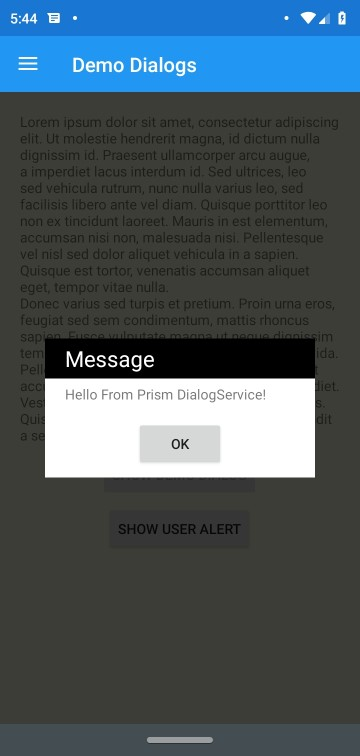

# Styling Dialogs

The Dialog Service has several extensibility points to help your provide richly styled dialogs.

## Relative Size Requests

There may be times in which you want to ensure that your Dialog is sized relative to the size of your user's screen.



You'll notice from this screenshot that the Dialog is sized slightly larger than the content of view. In order to achieve a consistent size for your dialog you may want to set the Relative Height or Width properties on the DialogLayout.

```xml
<Grid xmlns="http://xamarin.com/schemas/2014/forms"
      xmlns:x="http://schemas.microsoft.com/winfx/2009/xaml"
      xmlns:prism="http://prismlibrary.com"
      prism:DialogLayout.RelativeWidthRequest="0.75"
      prism:DialogLayout.RelativeHeightRequest="0.5"
      BackgroundColor="White"
      x:Class="HelloWorld.Views.DemoDialog">
```

When these properties are set it will create a binding between the Dialog's container and the Page's Width &/or Height properties. As a result whether the device is in Portrait or Landscape you can be sure that the dialog will occupy the relative size you've specified in relation to the Page's size.

## Positioning the Dialog

Under the covers, the Dialog Service uses an Absolute Layout to position the content on the Content Page. It will always center your dialog within the Content Page. If you wish to override this behavior for any reason such as mimicking a Toast alert you may wish to override the `LayoutBounds` of the Dialog.

```xml
<Grid xmlns="http://xamarin.com/schemas/2014/forms"
      xmlns:x="http://schemas.microsoft.com/winfx/2009/xaml"
      xmlns:prism="http://prismlibrary.com"
      prism:DialogLayout.LayoutBounds="0.5, 0.5, -1, -1"
      BackgroundColor="White"
      x:Class="HelloWorld.Views.DemoDialog">
```


## Background Mask

By default Prism will create a mask to indicate a separation between your Dialog and the content behind it. There are several extensibility points around the background mask that you may wish to use.

### Setting an explicit Mask Style in your Application

By default Prism will look for a Style named `FooStyle` in the Application Resources. If it does not exist it will be created at runtime automatically. In order to customize the style you may simply provide the style in your Application Resources like the following:

```xml
<prism:PrismApplication.Resources>
  <ResourceDictionary>
    <Style TargetType="BoxView" x:Key="FooStyle">
      <Setter Property="BackgroundColor" Value="Purple" />
      <Setter Property="Opacity" Value="0.5" />
    </Style>
  </ResourceDictionary>
</prism:PrismApplication.Resources>
```

### Overriding the Mask Style

For the times where you may want a one off on the mask style and you may want to use the default style on other dialogs, you can explicitly set the Mask Style to use. Note that you will need to be sure that your mask style is for a BoxView the same as if you were to set an override style in your Application Resources.

```xml
<Grid xmlns="http://xamarin.com/schemas/2014/forms"
      xmlns:x="http://schemas.microsoft.com/winfx/2009/xaml"
      xmlns:prism="http://prismlibrary.com"
      prism:DialogLayout.MaskStyle="{StaticResource MyMaskStyle}"
      BackgroundColor="White"
      x:Class="HelloWorld.Views.DemoDialog">
```

### Disabling the Mask Layer

In the event that you simply do not want to use a mask for the Dialog, you can simply set the `UseMask` property on DialogLayout to false. This will prevent the DialogService from inserting a Mask layer at all.

```xml
<Grid xmlns="http://xamarin.com/schemas/2014/forms"
      xmlns:x="http://schemas.microsoft.com/winfx/2009/xaml"
      xmlns:prism="http://prismlibrary.com"
      prism:DialogLayout.UseMask="false"
      BackgroundColor="White"
      x:Class="HelloWorld.Views.DemoDialog">
```

### Using an Explicit View for the Mask Layer

The DialogService uses a BoxView for the Mask Layer. There may be times where this may not be the right choice for you, and you may wish to use another element entirely such as an Image. For these times you can explicitly set the Mask View using the Mask property on the DialogLayout.

```xml
<Grid xmlns="http://xamarin.com/schemas/2014/forms"
      xmlns:x="http://schemas.microsoft.com/winfx/2009/xaml"
      xmlns:prism="http://prismlibrary.com"
      prism:DialogLayout.RelativeWidthRequest="0.75"
      BackgroundColor="White"
      x:Class="HelloWorld.Views.DemoDialog">
  <prism:DialogLayout.Mask>
    <Image Source="DialogBackground"
           Opacity="0.75" />
  <prism:DialogLayout.Mask>
```

### Implementation Notes

Note that the Dialog Service currently works by resetting the actively displayed ContentPage's Content and then resetting it. This means that there are many times in which you may have a dialog displayed while the user may still be able to interact with other UI elements such as a Navigation bar in either the NavigationPage, TabbedPage or MasterDetailPage. It is planned once Xamarin.Forms introduces support for transparent backgrounds on Modal pages to switch to placing the Dialog content inside of such a page. You may also consider using [Prism.Plugin.Popup](https://github.com/dansiegel/Prism.Plugin.Popup) which has an implementation of the Dialog Service that uses a PopupPage from Rg.Plugins.Popup to provide dialogs that disable user interaction with Navigation elements.

## Closing the Dialog when the Background is tapped

There may be times in which you may want to allow the user to dismiss your dialog by simply tapping outside of the dialog on the Mask layer. In order to enable this behavior you will need to set the `CloseOnBackgroundTapped` property:

```xml
<Grid xmlns="http://xamarin.com/schemas/2014/forms"
      xmlns:x="http://schemas.microsoft.com/winfx/2009/xaml"
      xmlns:prism="http://prismlibrary.com"
      prism:DialogLayout.CloseOnBackgroundTapped="true"
      BackgroundColor="White"
      x:Class="HelloWorld.Views.DemoDialog">
```
