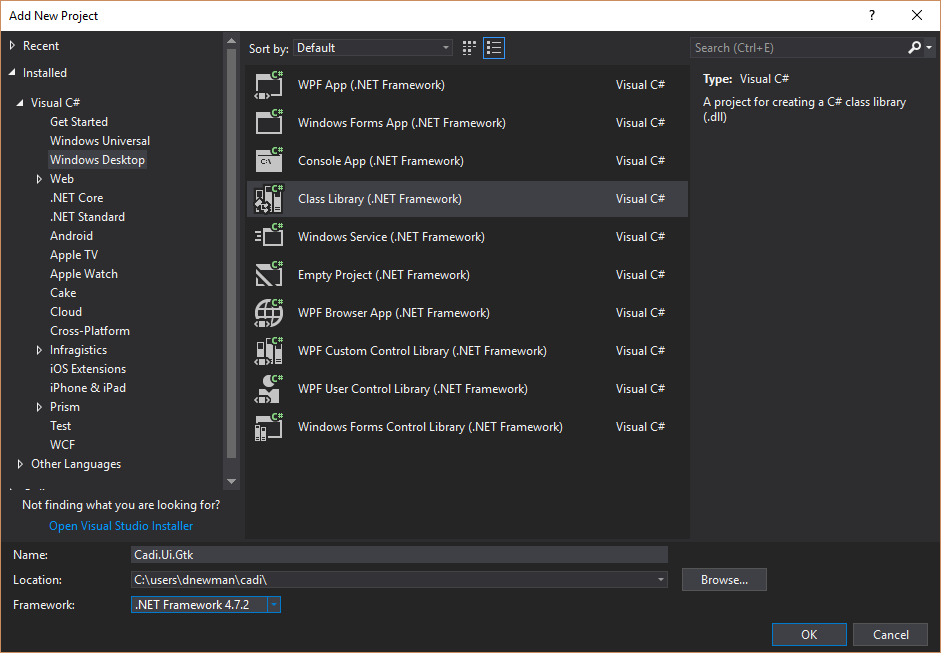
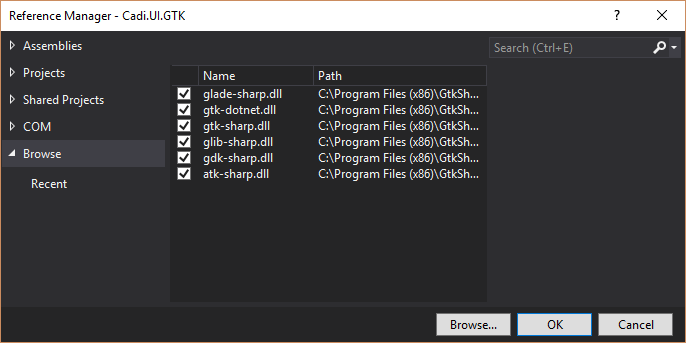
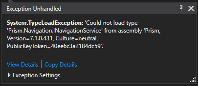
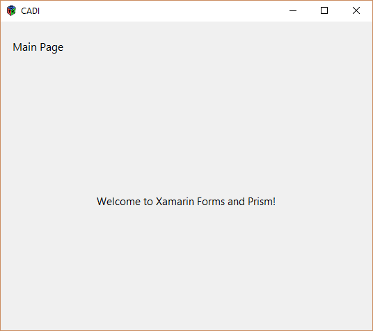

# Getting started with Prism for Xamarin.Forms on GTK#

## Creating a new solution

This guide assumes you have a Prism-based solution already created (see [Create Your First App](../creating-your-first-prism-app.md)).

## Installing GTK#

If you are developing on Windows then go to [The Mono Project](https://www.mono-project.com/download/stable/#download-win) and install the GTK# for Windows library. If you are on Linux or MacOS then install the mono packages (you will need to have mono 5.2 or greater to support .NET Standard 2.0).

## Adding the GTK# project

Go to `File > New Project` select `Windows Desktop` choose `Class Library (.NET Framework)` and make sure to select .NET Framework 4.7 or higher. Fill in the name for the project (i.e. `Project.Gtk`) and click ok.



Now that the project has been added, right click the project and select `Package Manager`. Install the Prism package that matches your solution (`Prism.DryIoc.Forms` or `Prism.Unity.Forms`), install the `Xamarin.Forms.Platform.GTK` package.

Expand the Project and Right Click on `References`, choose `Add Reference`, click `Browse`, navigate to the GTK# install directory and select the following DLLs.

* atk-sharp.dll
* gdk-sharp.dll
* glade-sharp.dll
* glib-sharp.dll
* gtk-dotnet.dll
* gtk-sharp.dll



## Add Program.cs and Main entry point

Expand the solution, rename `Class1.cs` to `Program.cs`, replace the class with the following code to add a main entry point and an IPlatformInitializer for GTK. 

```csharp
public class Program
{
    [STAThread]
    public static void Main(string[] args)
    {
        Gtk.Application.Init();
        Forms.Init();

        var app = new App(new GtkInitializer());
        var window = new FormsWindow();
        window.LoadApplication(app);
        window.SetApplicationTitle("Your App Name");
        window.Show();

        Gtk.Application.Run();
    }
}

public class GtkInitializer : IPlatformInitializer
{
    public void RegisterTypes(IContainerRegistry containerRegistry)
    {
        // Register any platform specific implementations
    }
}
```

## Change Project Settings

Right Click on the project and select `Properties` select `Application` change `Output Type` from 'Class Library' to 'Windows Application'. Save and close properties.

## Manually edit Prism References

Because the GTK project is a regular .NET Framework application we need to manually edit the `Project.csproj` to swap the prism references from .NET 4.5 to .NET Standard 2.0.

If you skip this step you will get this error message: `System.TypeLoadException: 'Could not load type 'Prism.Navigation.INavigationService' from assembly 'Prism, Version=7.1.0.431 ... '`



This is because the Prism.*IoC*.Forms library expects a version of the Prism library designed for mobile/forms and we currently have the net45 version (because this is a net45 project) of Prism selected automatically by NuGet.

Right click on the project and select `Unload Project` right click on the now grayed-out project and select `edit (ProjectName).csproj`. Change the hint paths for the DLLs from the Prism package: `Prism` & `Prism.Forms` from `net45` to `netstandard2.0`. 

We want to go from references like these (`..\packages\Prism.Core.7.1.0.431\lib\net45\*.dll`):

```xml
<Reference Include="Prism, Version=7.1.0.431, Culture=neutral, PublicKeyToken=40ee6c3a2184dc59, processorArchitecture=MSIL">
    <HintPath>..\packages\Prism.Core.7.1.0.431\lib\net45\Prism.dll</HintPath>
</Reference>
<Reference Include="Prism.Forms, Version=7.1.0.431, Culture=neutral, processorArchitecture=MSIL">
    <HintPath>..\packages\Prism.Forms.7.1.0.431\lib\net45\Prism.Forms.dll</HintPath>
</Reference>
```

To NetStandard 2.0 references like these (`..\packages\Prism.Core.7.1.0.431\lib\netstandard2.0\*.dll`):

```xml
<Reference Include="Prism, Version=7.1.0.431, Culture=neutral, PublicKeyToken=40ee6c3a2184dc59, processorArchitecture=MSIL">
    <HintPath>..\packages\Prism.Core.7.1.0.431\lib\netstandard2.0\Prism.dll</HintPath>
</Reference>
<Reference Include="Prism.Forms, Version=7.1.0.431, Culture=neutral, processorArchitecture=MSIL">
    <HintPath>..\packages\Prism.Forms.7.1.0.431\lib\netstandard2.0\Prism.Forms.dll</HintPath>
</Reference>
```

\* *do not copy this block, just change `net45` to `netstandard2.0`*

## Reload the Project and Run

Save the `csproj` file, right click the project and select `Reload Project`. Set the project as the Startup Project, build, and run the solution.

