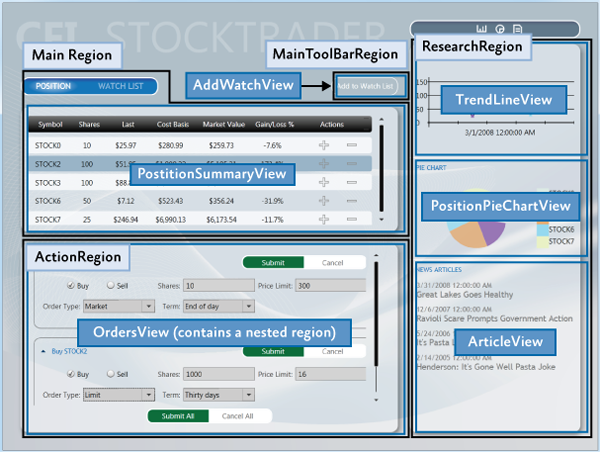
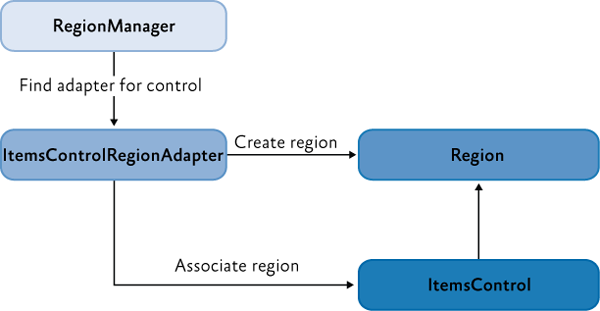
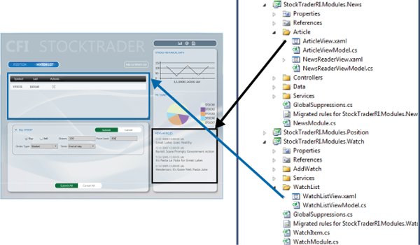
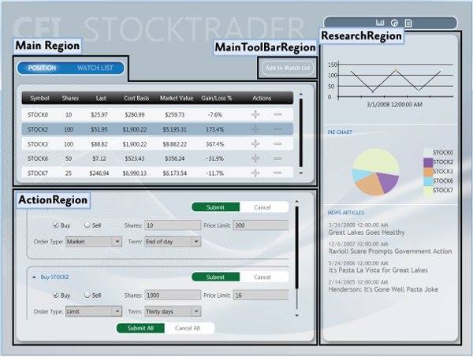
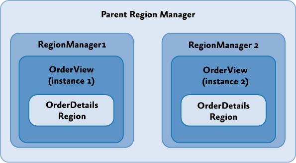

# Composing the User Interface Using the Prism Library for WPF

A composite UI places independently developed views into named regions. The shell owns the layout; views and modules supply the content. This guide describes Prism 9.0.537 and uses the `Prism.Navigation.Regions` namespace. Start with [WPF setup](getting-started.md).



The illustrations show composition concepts from a historical sample. They are not screenshots of the setup walkthrough.

## UI Layout Concepts

WPF supports composition at design time with normal XAML, or at runtime with regions. Use regions where the content needs independent creation, navigation, replacement, or module ownership; not every control needs to be a region.

### Shell

The Prism WPF shell is a `System.Windows.Window`. It defines shared chrome, resources, and named places for content. Prism creates it through `CreateShell`, attaches the application's region manager, and shows it from the default `OnInitialized` implementation.

### Views

A view is usually a `UserControl` with a view model as its `DataContext`. A region can also hold other objects, with the host control and WPF data templates determining how they appear.

#### Composite Views

A view can contain child controls or nested regions. Keep the parent responsible for layout and coordination while child view models own their individual state. Use [commands](../../commands/commanding.md), [navigation parameters](../../navigation/navigation-parameters.md), or [events](../../event-aggregator.md) for explicit communication.

### Regions

A region holds `Views` and `ActiveViews`. The adapter connects those collections to the host control. Adding a view, activating it, deactivating it, and removing it are distinct operations.

#### Region Manager

`IRegionManager.Regions` locates regions by name. The `RegionManager.RegionName` attached property makes a supported control a region host. The attached region-manager reference and the parent hierarchy determine which manager receives that region.



Region names must be unique within one manager. Different scoped managers can contain the same region names.

#### Region Implementation

`IRegion` is the shared contract. WPF supplies `Region`, `SingleActiveRegion`, and `AllActiveRegion` for different activation policies. A ContentControl shows one active view; an ItemsControl can display all its region's views. Multiple stored views do not imply all are visible.

##### Module User Control to Region Mapping

A module knows the region contract, such as `MainRegion`, and contributes a view. It need not know the shell's concrete class or layout. Put shared region names in an appropriate application contract rather than scattering unrelated strings across modules.



#### Default Region Functionality

Adapters translate region operations into control behavior. Behaviors add discovery, registration, context, activity, and lifetime policies.

##### Region Adapter

The default WPF mappings are:

| Host | Adapter | Region policy |
| --- | --- | --- |
| `ContentControl` | `ContentControlRegionAdapter` | One active view |
| `ItemsControl` | `ItemsControlRegionAdapter` | All views active |
| `Selector`, including `TabControl` | `SelectorRegionAdapter` | Selection synchronized with activity |

Let the adapter own the host's content/items. Do not simultaneously bind `ItemsSource` or set competing content. Custom controls may require [a custom adapter](../../navigation/regions/region-adapters.md).

##### Region Behaviors

Default behavior registration is performed during Prism startup. A behavior is attached once to its region and listens for relevant region or host changes. Custom behavior keys should be unique; use the application configuration hooks to extend defaults.

##### Registration Behavior

`RegionManagerRegistrationBehavior` registers the region with the applicable manager as the host and its manager become available. Do not request navigation simply because a control object has been constructed; the named region must be registered first.

##### Auto-Population Behavior

`AutoPopulateRegionBehavior` loads the content registered for the region name through `IRegionViewRegistry` and responds to later registrations. This is discovery, not a navigation request, so it does not create a journal entry or invoke navigation callbacks.

##### Region Context Behaviors

`SyncRegionContextWithHostBehavior` and `BindRegionContextToDependencyObjectBehavior` synchronize region context between the region, host, and hosted dependency objects. Context is separate from each view's data context.

##### Activation Behavior

`RegionActiveAwareBehavior` updates `IActiveAware.IsActive` on participating views and view models. Setting a view model's property alone does not activate a region view; use `region.Activate(view)` or navigation for that change.

##### Region Lifetime Behavior

`RegionMemberLifetimeBehavior` examines a view when it is removed from `ActiveViews`. Its retention checks are, in order:

1. The view's `IRegionMemberLifetime.KeepAlive`
2. The data context's `IRegionMemberLifetime.KeepAlive`
3. The view's `RegionMemberLifetimeAttribute`
4. The data context's `RegionMemberLifetimeAttribute`

The default is to retain the view. `KeepAlive=false` removes a deactivated view from `Views`. `DestructibleRegionBehavior` then calls `IDestructible.Destroy()` on removed views and view models that implement it. This does not promise automatic disposal of every injected dependency.

Release resources owned by a removed view without disposing shared singleton services. Deactivation of a retained view is not destruction, and closing a shell is not necessarily equivalent to explicitly removing every view from its region.

##### Control-Specific Behaviors

`SelectorItemsSourceSyncBehavior` connects selector items and selected items to region views and active views. Its selection behavior is specific to WPF selectors; do not assume an identically named control on another platform uses the same adapter.

#### Extending the Region Implementation

Use [region adapters](../../navigation/regions/region-adapters.md) for control integration and [region behaviors](../../navigation/regions/region-behaviors.md) for region policies. Prefer these extension points over bypassing the region to mutate a host's items directly.

### View Composition

Choose how each region receives its content.

#### View Discovery

Register content under a region name, then let Prism populate matching regions when they are created. This is useful for startup content or views contributed by modules.

#### View Injection

Create a specific view and add it to an existing region. Injection gives the caller explicit control over the instance and its region-manager scope.

#### Navigation

`RequestNavigate` resolves or reuses a named destination and participates in navigation callbacks, confirmation, parameters, and journal history. The region must already exist. Read [basic region navigation](../../navigation/regions/basic-region-navigation.md) for the complete lifecycle.

#### When to Use View Discovery vs. View Injection

Use discovery when content should appear whenever a matching region is created. Use injection when a specific instance, creation time, or manager scope matters. Use navigation when destination reuse, navigation context, confirmation, or history matters. Registration alone does not make a region exist.

## UI Layout Scenarios

The examples below assume the application's `container` and `regionManager` services are available through dependency injection. Import `Prism.Ioc` and `Prism.Navigation.Regions` in C# files that use them.

### Implementing the Shell

Return the shell from `PrismApplication.CreateShell` and allow Prism to attach its region manager. Remove `StartupUri` from `App.xaml` so WPF does not independently create a second window. See the [complete startup example](getting-started.md).

#### Sample Shell

```xml
<Window x:Class="MyApp.Views.Shell"
    xmlns="http://schemas.microsoft.com/winfx/2006/xaml/presentation"
    xmlns:x="http://schemas.microsoft.com/winfx/2006/xaml"
    xmlns:prism="http://prismlibrary.com/"
    Title="Workspace" Width="1000" Height="700">
    <Grid>
        <Grid.ColumnDefinitions>
            <ColumnDefinition Width="220" />
            <ColumnDefinition Width="*" />
        </Grid.ColumnDefinitions>
        <ContentControl prism:RegionManager.RegionName="NavigationRegion" />
        <ContentControl Grid.Column="1" prism:RegionManager.RegionName="MainRegion" />
    </Grid>
</Window>
```

Keep the generated `InitializeComponent()` constructor and match `x:Class` to the C# namespace and class.

### Defining Regions

Assign the region name to a supported host control. Its adapter determines which collection is displayed and how activation affects presentation.

#### Sample App Shell Regions

A shell can separate navigation, workspace, and toolbar regions. A workspace view can define its own detail region. If multiple workspace instances contain the same nested region name, give each its own manager scope.



#### Adding a Region in XAML

```xml
<ContentControl prism:RegionManager.RegionName="MainRegion" />
```

Use the Prism WPF namespace `http://prismlibrary.com/`, including its trailing slash. A shared constant can also be referenced using `x:Static`.

#### Adding a Region by Using Code

```csharp
RegionManager.SetRegionManager(contentHost, regionManager);
RegionManager.SetRegionName(contentHost, "MainRegion");
```

`contentHost` is the WPF control instance; `regionManager` is the injected manager. Do not use the obsolete global `ServiceLocator` pattern to fetch it. Ensure the host is in the appropriate UI hierarchy before expecting the region to be available.

### Displaying Views in a Region When the Region Loads

For type-based discovery, register the view and its explicit view-model mapping:

```csharp
// App.RegisterTypes or IModule.RegisterTypes
containerRegistry.Register<CustomerListView>();
containerRegistry.Register<CustomerListViewModel>();
Prism.Mvvm.ViewModelLocationProvider.Register<CustomerListView, CustomerListViewModel>();

// Module initialization or another composition point
regionManager.RegisterViewWithRegion("MainRegion", typeof(CustomerListView));
```

In Prism 9, type-based discovery resolves the concrete view and calls the automatic wiring helper. You can alternatively register a factory:

```csharp
regionManager.RegisterViewWithRegion("MainRegion",
    provider => provider.Resolve<CustomerListView>());
```

A factory owns its data-context setup. A raw resolve does not invoke the navigation pipeline. If using the factory above, set `prism:ViewModelLocator.AutoWireViewModel="True"` on the view or arrange its data context in the factory.

The named overload also exists:

```csharp
containerRegistry.RegisterForNavigation<CustomerListView, CustomerListViewModel>("Customers");
regionManager.RegisterViewWithRegion("MainRegion", "Customers");
```

In **9.0.537**, this named discovery path calls `Resolve<object>("Customers")` without the automatic wiring step performed by type discovery. Set `AutoWireViewModel="True"` on the view if it needs that behavior. `RegisterForNavigation` records the view-model mapping; it does not itself assign a data context. Prefer type discovery for the simplest automatically wired example.

### Displaying Views in a Region Programmatically

```csharp
var orders = container.Resolve<OrdersView>();
IRegion region = regionManager.Regions["MainRegion"];
region.Add(orders, "OpenOrders");
region.Activate(orders);
```

Arrange the data context of an injected view as needed. `OpenOrders` identifies this instance within the region; it need not be a navigation registration name. Calling `Add` does not run navigation callbacks.

#### Ordering Views in a Region

`ViewSortHintAttribute` provides a string hint used by the default comparison. Hints use case-sensitive ordinal comparison. In the shipped 9.0.537 implementation, views **without** the attribute compare before views with it. Equal comparisons preserve the underlying collection order; do not assume the existence of an attribute forces a view to the front.

Set `region.SortComparison` to a `Comparison<object>` when the application needs a different order. The region exposes sorted `Views` and `ActiveViews`; a custom adapter can apply its own presentation policy.

### Sharing Data Between Multiple Regions

Region context conveys host data without replacing each view's data context:

```xml
<ContentControl prism:RegionManager.RegionName="CustomerDetails"
    prism:RegionManager.RegionContext="{Binding SelectedCustomer}" />
```

A hosted dependency object can read `RegionContext.GetObservableContext(this).Value` and subscribe to that observable object's `PropertyChanged` event. Remove the subscription when its owner is finished. Context can also be assigned with `region.Context = selectedCustomer`.

For a view model, pass the context through a binding, navigation parameter, or application service. Deriving a view model from `DependencyObject` solely to read an attached property unnecessarily couples it to the UI framework.

### Creating Multiple Instances of a Region

Use `Add` with `createRegionManagerScope: true` when separate editor instances contain identically named descendant regions:

```csharp
var editor = container.Resolve<CustomerEditorView>();
IRegion documents = regionManager.Regions["DocumentsRegion"];
IRegionManager editorRegions = documents.Add(
    editor, "Customer42", createRegionManagerScope: true);
documents.Activate(editor);
```

The returned manager is assigned to the editor and owns its descendant regions. Wait for those hosts to register before navigating them, and use this manager rather than the global manager for their names.



A region-manager scope isolates region names. It does not itself create a dependency-injection scope. Establish and dispose an owned DI scope separately if the editor requires one.

## Source reference

- [Default WPF adapters and behaviors](https://github.com/PrismLibrary/Prism/blob/ec6d1926b4a20540f1dbf2d90b432660670d0c30/src/Wpf/Prism.Wpf/PrismInitializationExtensions.cs)
- [Discovery paths and automatic wiring](https://github.com/PrismLibrary/Prism/blob/ec6d1926b4a20540f1dbf2d90b432660670d0c30/src/Wpf/Prism.Wpf/Navigation/Regions/RegionViewRegistry.cs)
- [Named navigation registrations](https://github.com/PrismLibrary/Prism/blob/ec6d1926b4a20540f1dbf2d90b432660670d0c30/src/Wpf/Prism.Wpf/Ioc/IContainerRegistryExtensions.cs)
- [Region additions, scopes, and sort comparison](https://github.com/PrismLibrary/Prism/blob/ec6d1926b4a20540f1dbf2d90b432660670d0c30/src/Wpf/Prism.Wpf/Navigation/Regions/Region.cs)
- [Retention precedence](https://github.com/PrismLibrary/Prism/blob/ec6d1926b4a20540f1dbf2d90b432660670d0c30/src/Wpf/Prism.Wpf/Navigation/Regions/Behaviors/RegionMemberLifetimeBehavior.cs)
- [Destruction on removal](https://github.com/PrismLibrary/Prism/blob/ec6d1926b4a20540f1dbf2d90b432660670d0c30/src/Wpf/Prism.Wpf/Navigation/Regions/Behaviors/DestructibleRegionBehavior.cs)
