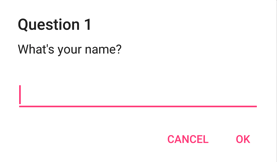

# Prompts

`IPrompts` requests text input and returns `Task<string?>`. Resolve it directly or use `INotifications.Prompt` after [notification registration](index.md).

```csharp
using Prism.Plugin.Essentials.Notifications;

string? title = await notifications.Prompt.DisplayAsync(
    "Rename report", "Enter a title",
    accept: "Save",
    cancel: "Cancel",
    placeholder: "Report title",
    maxLength: 80,
    keyboardType: KeyboardType.Default,
    initialValue: "Weekly summary");

if (title is null)
    return; // The user canceled.

if (string.IsNullOrWhiteSpace(title))
    return; // Apply the application's validation policy before saving.
```

`null` represents cancellation; an empty string is a distinct result. Do not overwrite persisted data on cancellation. `maxLength` and the keyboard hint improve input, but application validation remains necessary before using the value.



## Options

The scalar overload also accepts an optional `mask` string. For reusable configuration, use `DisplayAsync(title, message, PromptOptions)` with `Accept`, `Cancel`, `Placeholder`, `MaxLength`, `KeyboardType`, `InitialValue`, and optional `MaskOptions`.

A `MaskOptions` value describes a formatting pattern; it does not mean password concealment or encryption. Its default meta characters are `#` for a number, `w` for a letter, and `*` for a letter or number. Verify presentation/input behavior on the actual head, especially when selecting a keyboard or mask.

Prompt services are transient and need an initialized UI host. There is no cancellation-token overload. Avoid opening prompts automatically during construction or polling, and do not log entered values. For multi-field validation or a sensitive-input workflow, use an application-owned [Prism dialog](../../../dialogs/index.md) with an explicit lifecycle and data-handling policy.

## Source reference

These pinned source links describe the Plugins 9.0 baseline and require authorized access to the Prism.Plugins repository.

- [`src/Prism.Plugin.Essentials/Notifications/INotifications.cs`](https://github.com/PrismLibrary/Prism.Plugins/blob/bbafa527a111fb05f0078a86e810bc6e77c1807a/src/Prism.Plugin.Essentials/Notifications/INotifications.cs)
- [`src/Prism.Plugin.Essentials/Notifications/IPrompts.cs`](https://github.com/PrismLibrary/Prism.Plugins/blob/bbafa527a111fb05f0078a86e810bc6e77c1807a/src/Prism.Plugin.Essentials/Notifications/IPrompts.cs)
- [`src/Prism.Plugin.Essentials/Notifications/PromptOptions.cs`](https://github.com/PrismLibrary/Prism.Plugins/blob/bbafa527a111fb05f0078a86e810bc6e77c1807a/src/Prism.Plugin.Essentials/Notifications/PromptOptions.cs)
